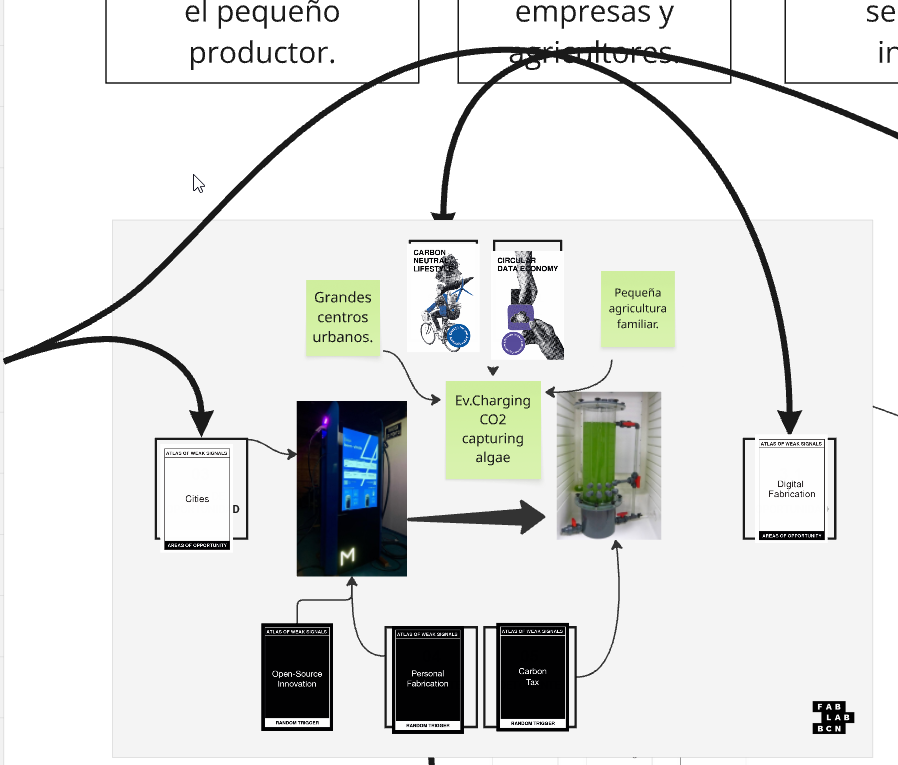
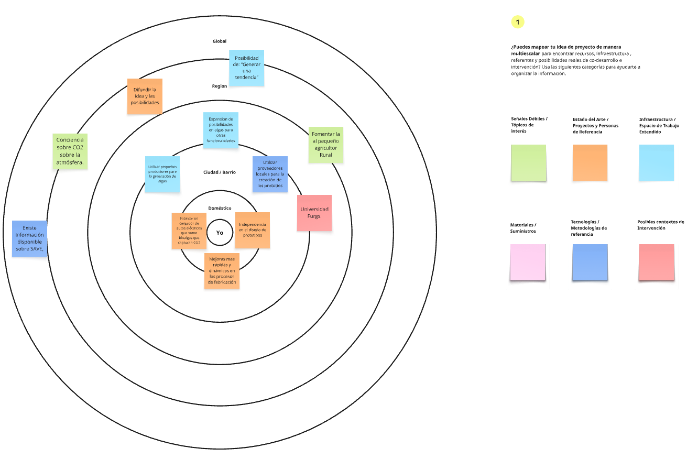

# Proyecto y contexto

En esta etapa la propuesta planteaba descubrir señales y pensar disparadores conceptuales que permitieran ir generando escenarios para futuros alternativos. Los ejes funcionaron como punto de partida: fabricación digital, herramientas open source, ambiente urbano y pequeños productores rurales. La conexión entre estos conceptos fue espontánea y motivante, porque permitía articular una propuesta con impacto real en lo local y en lo global simultáneamente.

Se construye un vínculo con la reducción de emisiones de CO2, la economía circular, la fabricación personal y la autonomía energética. En este escenario de definición ideológica clara, se encuentra un hilo conductor para desarrollar un proyecto que une alta tecnología con pequeños productores rurales en un vínculo distinto y significativo.

## Continuidades actuales y presentes alternativos

En la plataforma Miro, como espacio de diseño, se construyeron en etapas un mapa conceptual, escenarios posibles y un análisis de presentes alternativos. La identificación de continuidades actuales fue el primer paso: existe una carencia en la eficiencia energética, una migración hacia la eliminación de contaminantes y una necesidad urgente de disminuir la cantidad de CO2 en la atmósfera. El escenario actual evidencia una tensión entre la alta tecnología disponible y los pequeños productores que permanecen al margen de esas oportunidades.

Frente a ese diagnóstico, el presente alternativo que orienta el proyecto consiste en ser un actor que pueda dar una solución tecnológica capaz de fomentar simultáneamente la menor generación de CO2 y la agricultura de pequeños productores. Esta doble capacidad de respuesta define el núcleo del proyecto: no se trata de resolver un solo problema, sino de generar una propuesta que articule dos mundos que rara vez conversan.

## Acciones de diseño

Las acciones de diseño que sostienen este presente alternativo se organizan en tres ejes complementarios. El primero es generar movilidad urbana e incentivar al pequeño productor, reconociendo que la ciudad es el espacio donde se materializa el consumo energético y donde el productor puede encontrar un nuevo mercado. El segundo es promover la integración entre empresas y agricultores, entendiendo que la solución no puede ser puramente tecnológica sino que requiere de redes humanas y económicas que la soporten. El tercero es generar un diseño y producto que pueda ser el agente integrador, es decir, un objeto que funcione como nodo visible de esa red invisible.

El diagrama conceptual construido en la etapa de exploración articula estos tres ejes con señales débiles del Atlas como Open-Source Innovation, Personal Fabrication y Carbon Tax, sumando conceptos como Carbon Neutral Lifestyle, Circular Data Economy y la figura central de un cargador eléctrico con captura de CO2 mediante bioalgas. La fabricación digital aparece como pieza clave de ese sistema, habilitando la producción descentralizada y la adaptación local de los componentes.

## El proyecto: cargador de vehículos eléctricos con biorreactor de algas

El proyecto propone construir un cargador de autos eléctricos que integre un biorreactor de algas. Este objeto único combina dos tecnologías que, por separado, ya representan respuestas al cambio climático, pero que juntas generan una sinergia de alto impacto: el cargador eléctrico aprovecha una matriz energética compuesta crecientemente por fuentes renovables, mientras que el biorreactor de algas consume CO2 atmosférico y produce oxígeno de forma continua durante la carga del vehículo.

El sistema requiere módulos que controlen el pH del agua, actuadores que oxigenen el líquido para mantener vivas las colonias de microalgas, y dispositivos que gestionen el intercambio de los líquidos agotados por cultivos frescos. Esta complejidad técnica es, al mismo tiempo, una oportunidad de diseño: cada componente puede ser fabricado digitalmente, replicado y adaptado localmente mediante herramientas de fabricación personal y open source.

## Vínculo con los pequeños productores rurales

Una dimensión central del proyecto es su capacidad de conectar a pequeños agricultores dedicados al cultivo de microalgas con el ecosistema urbano del transporte eléctrico. El diagrama multiescalar construido durante el proceso de diseño articula esta red desde el nivel doméstico hasta el global: en el centro, la fabricación independiente de prototipos; en la escala barrial, el uso de pequeños productores para la generación de algas y la articulación con proveedores locales; en la escala regional, la expansión de las posibilidades del cultivo de algas hacia otras funcionalidades; y en la escala global, la posibilidad de generar una tendencia replicable.

Este esquema multiescalar no es solo una representación teórica, sino una hoja de ruta práctica. Universidad Furg aparece como aliada estratégica en el nivel regional, lo que sugiere que el proyecto tiene potencial académico y de investigación aplicada. La generación de conciencia sobre el CO2 en la atmósfera y la existencia de información disponible sobre sistemas SAVE refuerzan la viabilidad conceptual y técnica de la propuesta.

## Logros y desafíos del proceso

Al principio un poco caótico, pero luego de entender su mecánica, el proceso de diseño en Miro resultó muy dinámico y revelador. La herramienta permitió construir de manera visual las conexiones entre señales débiles, oportunidades y acciones de diseño, haciendo visible una trama que de otro modo hubiera permanecido implícita. La posibilidad de ver el trabajo en construcción y de rastrear las asociaciones conceptuales etapa por etapa fue interesante y me dio una perspectiva distinta a la que yo utilizaría. Esto me parece innovador e interesante al mismo tiempo; además de no haber oído nunca de la herramienta, su concepto principal es agradable a la vista y permite una mirada macro de lo plasmado, permitiendo, en cierto punto, "ver" las ideas.

La mayor dificultad radica en la complejidad técnica del sistema: articular el control de pH, la oxigenación del biorreactor y el manejo de los líquidos en un único objeto de diseño es un desafío que requiere iteración rápida y prototipado constante. Mejoras más ágiles y dinámicas en los procesos de fabricación, posibilitadas por la fabricación digital, son una condición necesaria para avanzar. La independencia en el diseño de prototipos y la fabricación local son, en ese sentido, tanto una meta como un método de trabajo.

El esquema de alternativas presentes constituye la bajada conceptual que pone al proyecto frente al desafío concreto de encontrar la vinculación entre la tecnología de algas, la movilidad eléctrica y la economía de los pequeños productores. Ese es el núcleo del proyecto: un objeto que no solo carga vehículos, sino que también carga de sentido una red de personas, saberes y territorios, una alternativa que me gustaria llevar hasta el final.

### Repositorio de miro
[mi miro](https://miro.com/app/board/uXjVJNzzOUI=/)