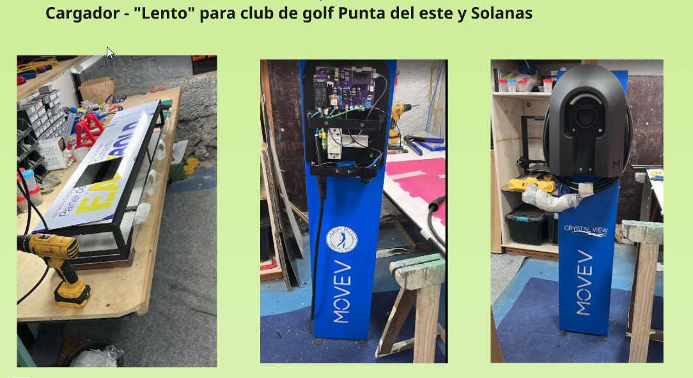
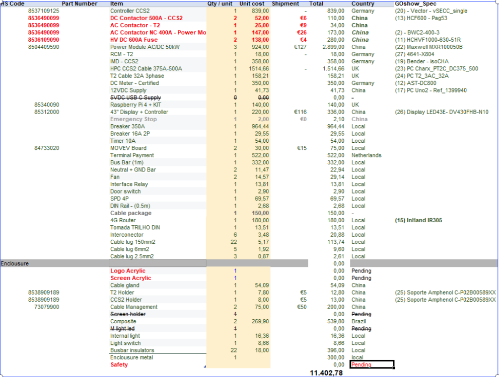

# MD03
### QUE - La propuesta
En este módulo se abordaron todos los cambios que ha experimentado el proyecto como consecuencia de la evolución de los conocimientos adquiridos a lo largo de las distintas disciplinas del posgrado, así como de la naturaleza dinámica del contexto tecnológico, económico y productivo en el que se desarrolla.

La iniciativa surgió originalmente como un proyecto con objetivos y alcances bien definidos. Sin embargo, a medida que avanzó su desarrollo, diversos factores impulsaron una serie de modificaciones relevantes. Entre ellos se destacan la profundización en el análisis de los actores involucrados, la revisión de los costos asociados, la disponibilidad de proveedores para componentes críticos y la necesidad de adaptar la propuesta a nuevas condiciones del entorno. Todo ello llevó a una reformulación gradual del proyecto, manteniendo su objetivo principal, pero ajustando sus componentes y estrategias de implementación.

Uno de los elementos que inicialmente resultaba más innovador e interesante era la incorporación de un biorreactor como parte integral de la solución propuesta. No obstante, esta línea de trabajo dependía de un proyecto paralelo desarrollado por otra organización. Lamentablemente, los desastres naturales ocurridos en 2024 en el estado de Rio Grande do Sul provocaron importantes daños en la infraestructura y los recursos destinados a dicha iniciativa, afectando significativamente su continuidad. Se esperaba que durante 2025 se concretara una inyección de capital que permitiera retomar y fortalecer esas actividades, pero dicho financiamiento nunca llegó a materializarse. Como consecuencia, fue necesario retirar este componente de nuestro prototipo, ya que no contaríamos con la infraestructura necesaria para desarrollar la solución ni para abastecer posteriormente a los cargadores asociados al sistema.

Dado que los plazos del proyecto continuaban avanzando, se tomó la decisión de continuar con el desarrollo prescindiendo de esta funcionalidad y concentrando los esfuerzos en la mejora de las prestaciones y capacidades del cargador eléctrico.

### Como - Resolucion técnica
Otro aspecto relevante durante la evolución del proyecto fue la incorporación progresiva de documentación técnica más detallada, incluyendo esquemas eléctricos y diagramas de diseño. Esto permitió aumentar considerablemente la replicabilidad y escalabilidad de la solución, facilitando tanto su proceso de fabricación como las tareas de mantenimiento y reparación. Asimismo, se realizó una revisión completa de la cadena de suministro de los componentes de potencia, identificando nuevos proveedores que permitieran reducir los costos operativos y de fabricación sin comprometer la calidad ni la confiabilidad del producto final.

Estas modificaciones derivaron en una reorganización interna de la distribución de los componentes del sistema, con el objetivo de garantizar la compatibilidad entre las nuevas especificaciones técnicas y la arquitectura existente del cargador. Como resultado, también fue posible incrementar la potencia máxima de operación del equipo. Mientras que las versiones iniciales contemplaban configuraciones de 30 kW, 60 kW, 90 kW y 120 kW, la nueva generación de equipos se ha estandarizado en potencias de 50 kW, 100 kW y 150 kW. Esta última representa prácticamente el límite superior alcanzable en sistemas de carga rápida que no requieren refrigeración líquida, lo que constituye una mejora significativa en términos de competitividad y capacidad de servicio.

### Un Como ... no esperado, pero bienvenido.

Como complemento al proyecto principal, considero importante destacar un resultado indirecto, pero de gran valor, derivado de los conocimientos y competencias adquiridos durante el posgrado. A lo largo del desarrollo del proyecto no solo se fortalecieron capacidades técnicas específicas, sino que también se desarrolló una visión transversal del proceso de diseño, prototipado y materialización de soluciones tecnológicas, permitiendo aplicar estos aprendizajes en contextos reales de negocio.

En este sentido, durante el verano de 2026 surgió la oportunidad de comercializar una serie de cargadores lentos para vehículos eléctricos, alimentados mediante redes convencionales de 220 V. En total, se concretó el suministro de nueve unidades destinadas a un club de golf y a otros clientes particulares, constituyendo una experiencia práctica sumamente enriquecedora para validar metodologías, procesos de diseño y capacidades de fabricación desarrolladas durante el posgrado.

Para este proyecto se diseñó un pequeño tótem de estacionamiento destinado a alojar y presentar los cargadores de forma funcional y estéticamente atractiva. La solución incluyó una estructura metálica rígida, iluminación interna, revestimiento exterior en paneles de ACM (Aluminium Composite Material), elementos acrílicos retroiluminados (backlight) y cajas de control eléctrico para la gestión de la corriente de carga, además de integrar el modelo de cargador desarrollado por nuestra empresa.

La concepción y el diseño integral del producto fueron realizados aplicando los conocimientos adquiridos durante el curso, especialmente aquellos vinculados al diseño de productos, prototipado, fabricación digital y resolución de problemas de ingeniería. La estructura metálica fue diseñada, fabricada, soldada y ensamblada personalmente, permitiendo llevar a la práctica conceptos relacionados con manufactura, resistencia estructural y montaje. Por otra parte, los paneles de ACM fueron diseñados internamente, incluyendo los archivos necesarios para el proceso de fresado CNC, aunque la producción final fue realizada por un proveedor local especializado.

Esta experiencia representó una valiosa instancia de validación práctica de los conocimientos incorporados durante el posgrado. Además de generar un producto comercializable y funcional, permitió poner a prueba procesos de diseño, fabricación, integración de componentes y coordinación con proveedores externos en un contexto real de mercado. En cierta medida, esta iniciativa funcionó como una pequeña “prueba de fuego” durante la evolución del proyecto principal, demostrando la aplicabilidad concreta de las metodologías aprendidas y fortaleciendo la confianza en la capacidad de transformar ideas y conceptos en soluciones tecnológicas tangibles y comercialmente viables.

### Costo unitario al iniciar el proyecto.
Antes de comenzar con el análisis de esta etapa del proyecto, considero importante destacar un aspecto que adquirió una relevancia creciente a lo largo del posgrado: la gestión y el control de los costos asociados al desarrollo de la solución propuesta.

Si bien el foco principal estuvo puesto en el diseño del producto, la innovación tecnológica y la aplicación de técnicas de fabricación digital, de manera paralela, y especialmente a partir de los contenidos abordados en el módulo de Emprendedurismo, comenzamos a incorporar una perspectiva más estratégica vinculada a la viabilidad económica del proyecto. Este enfoque permitió comprender que el éxito de una solución tecnológica no depende únicamente de su desempeño técnico, sino también de su capacidad para ser fabricada, comercializada y escalada de forma sostenible.

La evaluación permanente de costos se transformó así en una herramienta fundamental para la toma de decisiones de diseño, la selección de proveedores, la elección de materiales y la definición de procesos productivos. Muchas de las modificaciones realizadas durante la evolución del proyecto estuvieron motivadas, precisamente, por la necesidad de optimizar la relación entre prestaciones técnicas y costos de fabricación.

Por este motivo, considero pertinente hacer especial énfasis en la imagen que se presenta a continuación, ya que refleja el costo unitario estimado que manejábamos al inicio del año 2025. Este valor constituye un punto de referencia clave para comprender la evolución posterior del proyecto y permite visualizar con claridad el impacto que tuvieron las decisiones de rediseño, la optimización de componentes y la búsqueda de nuevos proveedores sobre la estructura de costos del producto.

La comparación entre los costos iniciales y los valores alcanzados en etapas posteriores no solo evidencia una mejora en la eficiencia del diseño, sino que también demuestra la importancia de incorporar herramientas de análisis económico desde las primeras fases de desarrollo de un emprendimiento tecnológico. De esta manera, el proyecto fue evolucionando desde una visión predominantemente técnica hacia una propuesta más integral, donde la innovación, la manufactura y la sostenibilidad económica pasaron a ser elementos inseparables del proceso de diseño.

Desde una perspectiva de mercado, los vehículos eléctricos continúan consolidándose como una tendencia de crecimiento sostenido a nivel mundial. Los avances permanentes en seguridad, autonomía, eficiencia energética y reducción de costos de fabricación permiten prever que esta tecnología seguirá expandiéndose durante los próximos años. En este contexto, la infraestructura de carga adquiere una importancia estratégica cada vez mayor.

Uruguay presenta actualmente una situación particularmente favorable en este sentido, siendo uno de los países con mayor densidad de infraestructura de carga para vehículos eléctricos de la región. Se estima que existe aproximadamente un cargador por cada 35 vehículos eléctricos en circulación. Sin embargo, diversos estudios y experiencias internacionales sugieren que una relación más adecuada para acompañar el crecimiento del parque automotor eléctrico se sitúa entre 10 y 13 vehículos por cargador. Esto indica que aún existe un mercado potencial significativo para la instalación de nuevas estaciones de carga y para el desarrollo de soluciones tecnológicas asociadas.

Adicionalmente, los acuerdos comerciales vigentes dentro del Mercosur abren la posibilidad de proyectar la comercialización de la solución hacia mercados regionales de gran escala, particularmente Brasil y Argentina, países que muestran un crecimiento sostenido en la adopción de la movilidad eléctrica y en la demanda de infraestructura de recarga.

### Avance y próximos pasos.

A pesar de los avances alcanzados, el proceso de prototipado continúa representando uno de los principales desafíos del proyecto. Actualmente, la fabricación de una única unidad presenta costos elevados debido a la ausencia de economías de escala. Solo la estructura metálica tiene un costo aproximado de USD 700 por unidad, mientras que el costo total de un cargador completamente ensamblado ronda los USD 7.500.

En consecuencia, la etapa actual del proyecto se encuentra enfocada en la búsqueda de mecanismos de financiamiento que permitan producir las primeras unidades comerciales, validar el producto en escenarios reales de operación y avanzar hacia una futura etapa de industrialización y escalamiento productivo.