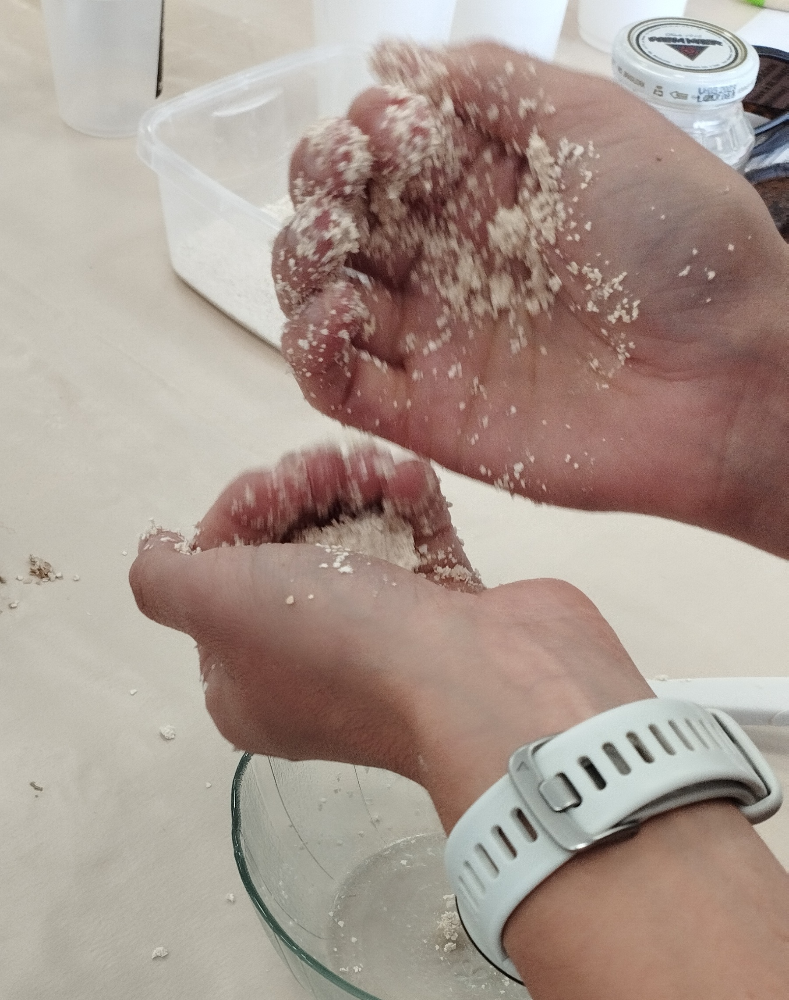
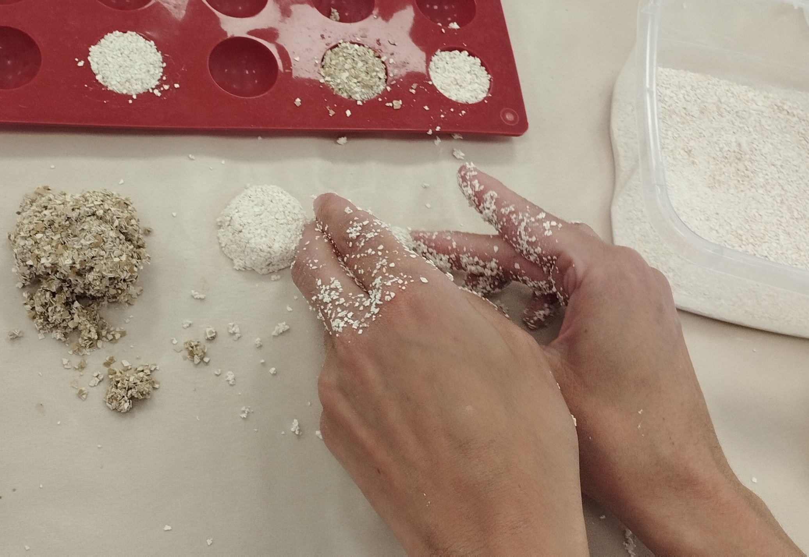
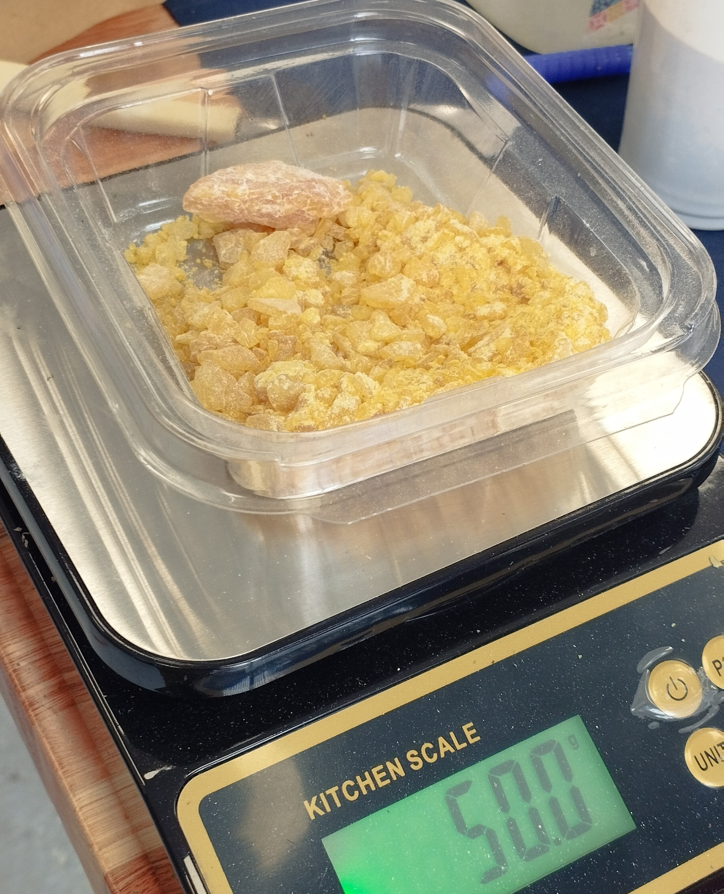
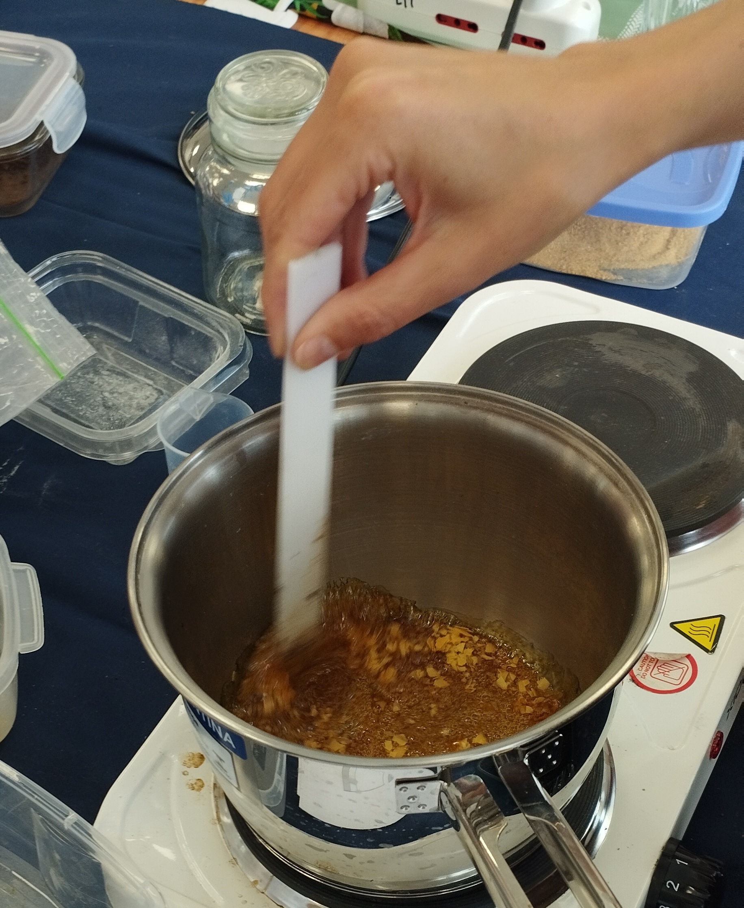
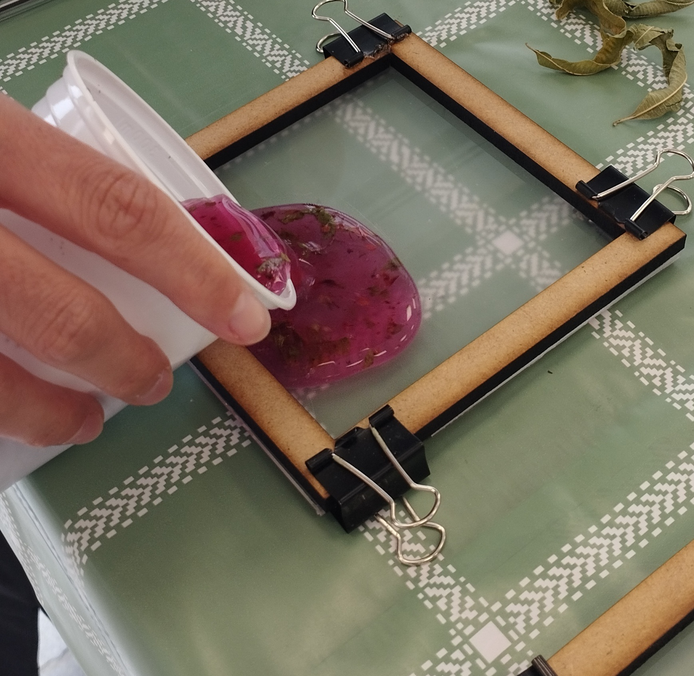
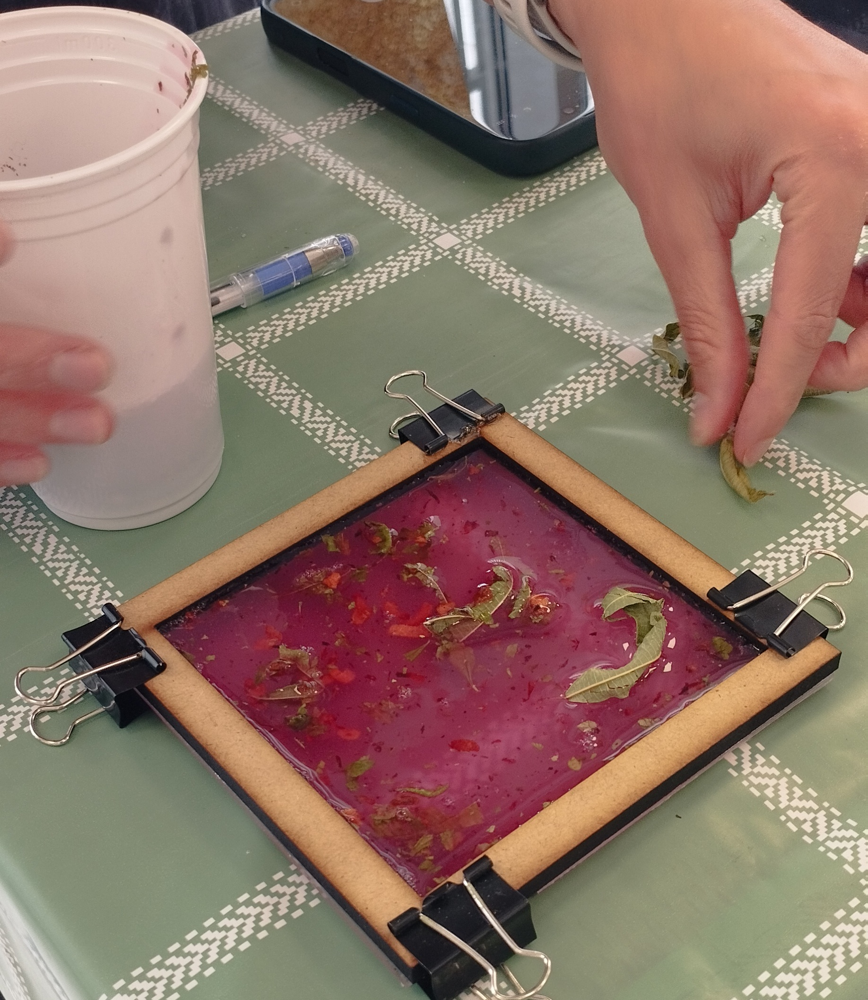
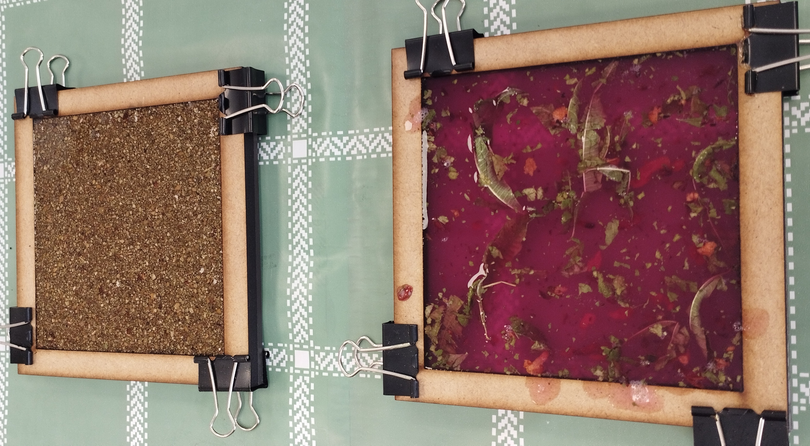

# MI02 – Desarrollo sostenible y economía circular

## Introducción

En este módulo trabajamos sobre el concepto de **sostenibilidad** y cómo se relaciona con nuestros hábitos cotidianos. Más que abordar el tema desde una definición teórica, la propuesta fue reflexionar sobre nuestro propio estilo de vida y posicionarlo dentro de una escala de consumo.

A partir de un ejercicio visual con una escala de ocho colores, analizamos distintos comportamientos: desde los más cuestionados ambientalmente hasta los más alineados con principios de sostenibilidad. Esta actividad no fue neutra, sino que implicó tomar una postura crítica, especialmente al contrastar enfoques europeos con la realidad local.

### Experiencia en laboratorio de biomateriales (UTEC Minas)

Como parte del módulo, participamos en un taller práctico en el laboratorio de biomateriales de **UTEC en Minas**. La experiencia fue interesante porque combinaba elementos de laboratorio tradicional con una lógica casi culinaria: recetas, mezclas, temperaturas y tiempos.

La actividad fue guiada por la **Lic. María Clara Freyre**, quien introdujo los conceptos básicos de biomateriales y su evolución. Originalmente, el término proviene del campo de la medicina y refiere a materiales compatibles con el cuerpo humano. Hoy en día, el concepto se amplía hacia materiales sostenibles, biodegradables o regenerativos.

### Materiales y enfoque

Trabajamos con distintas formulaciones basadas en:

* **Polímeros**
* **Plastificantes**
* **Aglutinantes**
* **Aditivos**

Cada estación proponía una receta distinta, lo que permitía comparar resultados y entender cómo pequeñas variaciones afectan el comportamiento final del material.

### Estación 1 – Biocompuesto con alginato

En esta primera prueba utilizamos **alginato de sodio** como aglutinante, incorporando aditivos como cáscara de huevo y de mejillones.

* **Variable clave:** La granulometría del material. Al reducir el tamaño de las partículas, el resultado mejoraba en términos de elasticidad y control de forma.
* **Expectativa:** El producto final debería haber sido un material sólido, compacto y resistente, con características similares a una piedra. El tiempo de curado recomendado era de al menos dos días.

  
  

**Problemas detectados:**
Nuestra biocerámica no quedó con las características esperadas; intentamos cambiar un poco la receta agregando más alginato, pero igualmente no notamos una mejora importante. Lo que notamos (aunque no pudimos llegar a realizar un experimento concreto) es que, al tener una granulometría más grande, dejar reposar la mezcla unos minutos dio la impresión de que mejoraría la unión.

### Estación 2 – Bioplástico con resina de pino

En esta estación trabajamos con **colofonia** (resina de pino), obteniendo un material mucho más rígido.

El proceso implicó:
1.  Mezcla inicial en frío con alcohol.
2.  Calentamiento hasta fundir la resina.
3.  Incorporación del resto de los componentes.
4.  Mezclado hasta lograr una pasta homogénea.

El manejo térmico fue clave, tanto por la consistencia como por los vapores generados. El moldeo se realizó con matrices de **OSB**, utilizando papel encerado como desmoldante. Un detalle interesante fue la diferencia de espesores entre las partes del molde, lo que facilitaba el prensado.

  
  

**Estado actual:** El material no solidificó rápidamente  y hasta la fecha no está sólido; mantiene aún un grado de flexibilidad.

**Problemas detectados:**
Aunque la receta hablaba de colocar gramos de compuestos orgánicos, nuestra selección fue hojas secas. Al ser extremadamente livianas, pasaron a tener mucha incidencia en el resultado final de la pieza. En la segunda imagen esta como quedo la mexcla antes de vertirla al molde. Habría que rever esta condición, ya que debería considerarse una relación entre peso y volumen del material.

### Estación 3 – Bioplástico a base de gelatina

En esta etapa utilizamos:
* Gelatina sin sabor
* Agua con tinte de Santa Rita
* Vinagre
* Glicerina

El proceso fue más controlado:
1.  Mezcla en frío.
2.  Calentamiento sin llegar a ebullición.
3.  Incorporación de glicerina.
4.  Reposo antes del vertido.

El moldeo se realizó en un marco de **MDF** con base de acrílico. Una ventaja importante fue el tiempo de trabajo antes de la gelificación, que permitió experimentar con capas y distintos aditivos (yerba mate, flores de Santa Rita y cáscaras).

**Resultado:** Se hicieron dos combinaciones diferentes. El resultado fue un material flexible, con un comportamiento similar a la silicona. En uno de ellos, que dejamos más transparente, notamos una belleza muy peculiar; discutimos en el laboratorio la posibilidad de realizar otros trabajos con este acabado.

    
     
       

### Estación 4 – Observación

No llegamos a realizar esta práctica, pero se pudo observar una técnica de **extrusión mediante jeringa**. El material utilizado gelatiniza al contacto con agua, generando filamentos que luego secan manteniendo la elasticidad. También se mostró un bioplástico aireado, con textura porosa y potencial decorativo.

**Posibilidad a futuro:**
Estoy viendo la posibilidad de experimentar con materiales distintos para crear algún tipo de biomaterial con cierto nivel de **conductividad**. Actualmente estoy realizando pruebas sobre esto.

### Resultados y aprendizajes

La experiencia permitió entender cómo distintos biomateriales pueden adaptarse a usos específicos según su formulación. Más allá del resultado final, lo más valioso fue el proceso de prueba y error, y cómo variables como temperatura, proporciones o granulometría afectan directamente el comportamiento del material.

También fue interesante ver que muchos de estos materiales pueden producirse con recursos accesibles, lo que los vuelve relevantes en contextos locales.

### Dificultades

* Control de temperatura en materiales sensibles.
* Desmolde en materiales rígidos.
* Manejo de vapores en procesos térmicos.
* Relación peso/volumen: el peso no siempre es el único factor determinante; el volumen asociado puede jugar en contra.
* La granulometría de los materiales como factor crítico de unión.

### Reflexión final

En mi opinión, esta instancia fue muy interesante, no solo por los conceptos abordados (me vine con muchas ideas aplicables a mi contexto), sino por el intercambio informal con el grupo de docentes de UTEC y mis compañeros. Aunque participamos frecuentemente en actividades en línea, un almuerzo informal para hablar de intereses e ideas nos aproxima y nos ayuda a entender las motivaciones de cada uno de una manera más fluida.

Un agradecimiento especial a mi compañera de laboratorio  Luciana! a la docente **María Clara Freyre**, y también a **Carolina, Victoria y Laura**. ¡Todas unas genias!

### Recursos y referencias

* Taller de biomateriales – UTEC Minas
* Docente: María Clara Freyre
* Contenidos del módulo MI02
* Registro audiovisual propio