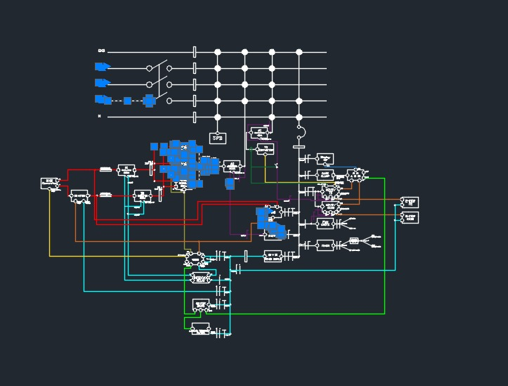
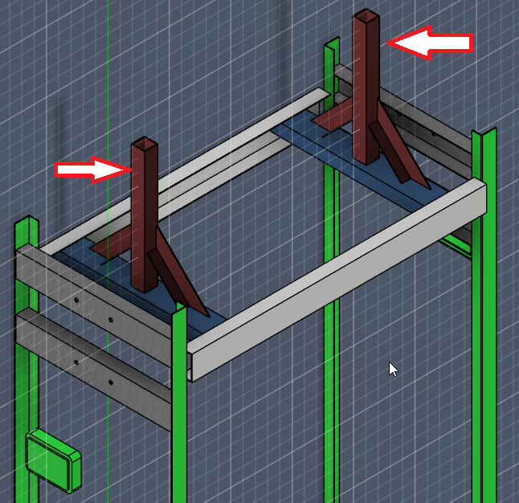
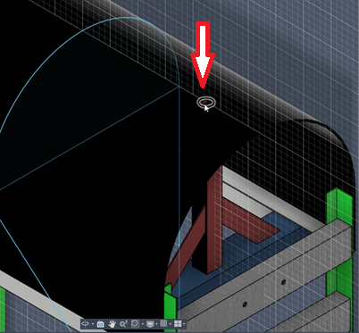
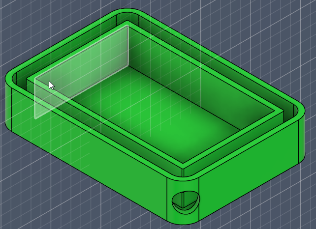
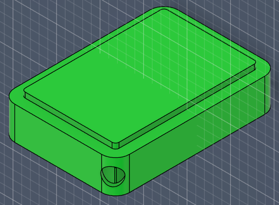
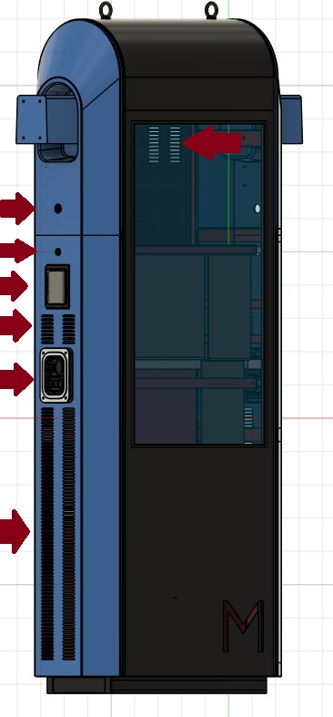

# Documentación del Proyecto  
## Rediseño estructural de cargador rápido para vehículos eléctricos

> **Estado:** Borrador 3 con imagenes
> **Actualización:** 11-05-2026
> **Curso:** Posgrado en Fabricación Digital  
> **Autor:** Juan Pedro de León  

## Introducción

Este proyecto surge a partir de la necesidad de **reformular completamente el diseño estructural** de un cargador rápido para vehículos eléctricos que ya se encontraba en desarrollo. El modelo original presentó múltiples problemas vinculados al transporte, la instalación en campo y la resistencia a la intemperie, lo que dejó en evidencia limitaciones tanto en el diseño del gabinete como en la estrategia de fabricación y provisión de componentes.

En una etapa inicial del posgrado se exploró la posibilidad de integrar un biorreactor de algas como componente ambiental. Sin embargo, durante el desarrollo real del proyecto aparecieron **problemas de diseño y cambios en los proveedores de las fuentes de alimentación**, lo que llevó a una redefinición profunda del alcance. A partir de esto, se decidió **abandonar la integración del biorreactor** y enfocar los esfuerzos en una **reestructuración total del cargador**, manteniendo una estética general similar, pero replanteando desde cero su arquitectura interna, estructura portante y lógica de fabricación.

Esta documentación registra ese recorrido: decisiones, errores, cambios de rumbo y aprendizajes, con foco en el **rediseño estructural, la fabricación digital, la modularidad y la autonomía técnica**.

## What — ¿Qué hice?

Realicé una **reestructuración completa del diseño estructural** de un cargador rápido para vehículos eléctricos, desarrollando un nuevo modelo desde cero en **Fusion 360**, con los siguientes objetivos:

- Resolver problemas de transporte e instalación.
- Mejorar la resistencia a la intemperie.
- Reorganizar completamente la estructura interna.
- Analizar y corregir la carga estructural del gabinete.
- Diseñar bandejas específicas para la parte eléctrica y electrónica.
- Mejorar los sistemas de ventilación y vedación.
- Reducir dependencia de terceros mediante fabricación propia.
- Mantener continuidad estética con el modelo anterior.
- Adaptar el producto a nuevas configuraciones de potencia y cambios de proveedores estratégicos.

## Why — ¿Por qué lo hice así?

El proyecto original evidenció fallas que no podían resolverse mediante ajustes menores. 
A partir del análisis del prototipo existente surgieron problemáticas estructurales y de proceso que
hicieron evidente la necesidad de un replanteo completo del diseño:

- Problemas estructurales asociados al peso y a la carga del gabinete.
- Ingreso de agua en componentes críticos.
- Dificultades de transporte debido a dimensiones y distribución de masas.
- Dependencia de proveedores externos sin control directo sobre el diseño.
- Cambios en los proveedores de las fuentes de alimentación, lo que obligó a reconsiderar el layout interno.
- Dificultad para conseguir determinados materiales en Uruguay y especialmente en el interior del país.

Ante este escenario, la decisión fue **no “parchar” el diseño existente**, sino **reiniciarlo completamente**,
priorizando los siguientes criterios:

- Fabricabilidad.
- Modularidad.
- Robustez estructural.
- Facilidad de ensamblaje y mantenimiento.
- Capacidad de adaptación futura ante cambios de componentes.
- Mayor disponibilidad local de materiales y procesos productivos.

El hecho de contar con **dibujos técnicos completos y control total del modelo CAD** permite que, ante un cambio definitivo de proveedor de fuentes, los ajustes internos necesarios puedan realizarse de manera autónoma, sin volver a depender de terceros.

<!-- MARCADOR: aquí puede agregarse una imagen comparativa
     del diseño original vs. el rediseño estructural -->

## Investigación y referencias

La toma de decisiones estuvo apoyada en distintas fuentes y experiencias, entre ellas:

- Análisis directo del prototipo físico existente.
- Referencias de cargadores EV comerciales.
- Estudios y ejemplos de gabinetes industriales para uso exterior.
- Evaluación de cargas estructurales y distribución de peso.
- Consultas técnicas con proveedores.
- Relevamiento de disponibilidad de materiales en plaza.
- Uso de herramientas de IA como apoyo conceptual y de redacción (documentado).

<!-- MARCADOR: aquí pueden agregarse enlaces externos,
     capturas de referencias o esquemas analizados -->

## How — ¿Cómo lo hice?

### Rediseño estructural

El proceso comenzó con el modelado completo del cargador desde cero en **Fusion 360**, 
abandonando el modelo anterior, dentro de algunas limitaciónes que por temas económicos dificultaban un cambio radical, por lo que nos obligo a tratar de mantener algunas caracteristicas externas pero si replanteando la arquitectura interna del equipo.

- Nueva lógica de armado por subconjuntos.
- Separación clara entre:
  - Estructura portante.
  - Cerramientos.
  - Bandejas eléctricas y electrónicas.
  - Sistemas de ventilación.
- Revisión de puntos críticos de carga estructural.
- Redefinición de refuerzos, uniones y accesos.

### Electrónica y eléctrica

Se reorganizó completamente la disposición interna de los sistemas eléctricos y electrónicos del cargador, contemplando tanto la etapa de potencia como los elementos de control y comunicación.

- Creación de bandejas específicas para potencia y control.
- Mejor ordenamiento interno del cableado.
- Separación funcional de zonas sensibles.
- Diseño preparado para futuros ajustes derivados de cambios de proveedor.
- Se anexa al diseño un plano electrico, que esta **en desarrollo** en este momento.

#### Punto 1: Redefinición del sistema de potencia por cambio de proveedor

Ante la necesidad de sustituir el proveedor original de fuentes DC, inicialmente se trabajaba con **Phoenix Contact**, empresa alemana que ofrecía módulos base de **30 kW DC**, modelo [CHARX PS-M2/825DC/1000DC/30KW](https://www.phoenixcontact.com/pt-br/produtos/modulo-de-potencia-dc-charx-ps-m2-825dc-1000dc-30kw-1296467). Esta configuración permitía desarrollar cargadores de **30, 60, 90 y 120 kW**.

Sin embargo, se trataba de una solución de costo elevado y con escasa o nula representación comercial en Uruguay para la línea específica de cargadores vehiculares. Cabe destacar que el proyecto original había sido concebido considerando abastecimiento desde Brasil, país donde **Phoenix Contact** sí cuenta con presencia consolidada.

Posteriormente se migró a un nuevo proveedor chino, **Maxwell**, cuya fuente base DC es de **50 kW**, modelo [MXR100050B](https://www.maxwellpower.cn/productinfo/2413106.html). Esta nueva plataforma permite configuraciones de **50, 100 y 150 kW**, siendo este último el valor máximo previsto antes de requerir refrigeración líquida en el cable de carga.

Este cambio impactó directamente en el rediseño interno del gabinete, ya que la estructura pasa a alojar **3 fuentes en lugar de 4**. También resulta relevante la diferencia de peso entre ambos modelos: mientras la fuente de **30 kW** posee un peso aproximado de **27 kg**, la de **50 kW** pesa aproximadamente **23 kg** por unidad.

La combinación de estos factores generó mejoras adicionales de diseño y operación:

- **Mejora en la relación costo / potencia instalada del sistema**  
  Si bien el precio unitario de cada fuente se mantiene en valores similares respecto al proveedor anterior, la mejora aparece en la capacidad entregada por módulo. Anteriormente cada fuente aportaba **30 kW**, mientras que ahora cada unidad entrega **50 kW** por un costo equivalente. Esto genera una relación **USD/kW significativamente más favorable**, permitiendo aumentar la potencia total del cargador sin incrementar proporcionalmente la inversión en fuentes de alimentación.

- **Reducción del peso total del equipo**  
  El sistema anterior contemplaba fuentes de **30 kW** con un peso aproximado de **27 kg por unidad**, pudiendo instalar hasta cuatro módulos. La nueva configuración utiliza fuentes de **50 kW** de aproximadamente **23 kg cada una**, requiriendo solo tres unidades para alcanzar **150 kW**. Como resultado, se obtiene una reducción considerable del peso total instalado, mejorando maniobrabilidad, transporte, montaje y exigencias estructurales del gabinete.

- **Mayor espacio interno disponible y mejor reorganización del layout**  
  Al necesitar una fuente menos y manteniendo dimensiones externas similares entre ambos modelos, se libera volumen útil dentro del gabinete. Ese espacio adicional permite replantear la distribución interna de bandejas, cableado, protecciones y componentes auxiliares, logrando un diseño más ordenado, accesible y técnicamente eficiente.

- **Mejora en la ventilación y circulación de aire**  
  Debido a que el tamaño general del gabinete prácticamente no se modificó, pero la cantidad de fuentes internas se redujo, se generan mayores zonas libres para el desplazamiento del aire. Esto favorece la circulación natural y forzada, disminuye puntos calientes internos y mejora el desempeño térmico general del cargador.

- **Mayor simplicidad para mantenimiento futuro**  
  La disponibilidad de más espacio libre en el interior evita que los componentes queden excesivamente compactados. Esto facilita tareas de inspección, limpieza, reemplazo de piezas, ajuste de conexiones y diagnóstico de fallas. En consecuencia, el mantenimiento correctivo y preventivo resulta más rápido, seguro y menos costoso a largo plazo.

#### Punto 2: Sustitución del PLC principal y adecuación a requisitos normativos

Como parte del rediseño eléctrico y funcional del cargador, se resolvió sustituir el controlador originalmente previsto, **Phoenix Contact EVPLC**, por el controlador **Vector vSECC.single**. Esta decisión respondió a la necesidad de avanzar hacia una arquitectura más alineada con estándares internacionales aplicables a infraestructura de carga rápida y con mayores posibilidades de certificación futura.

El equipo **vSECC.single** está concebido específicamente como controlador central para estaciones de carga AC/DC de un punto de carga, gestionando la comunicación entre el vehículo, backend, electrónica de potencia, medidores de energía y periféricos. Además, declara compatibilidad con protocolos y normas relevantes como **IEC 61851**.

La migración al controlador de **Vector** también permitió una integración más robusta con dispositivos de seguridad y medición exigidos en determinados mercados o procesos de homologación.

#### Integración con IMD (Insulation Monitoring Device)

Una de las mejoras más relevantes fue la incorporación de un **IMD** (*Insulation Monitoring Device*), dispositivo encargado de supervisar fallas de aislamiento o derivaciones a tierra en el sistema DC de alta tensión.

En términos prácticos, su función es comparable a una protección diferencial industrial o residencial, pero diseñada para trabajar sobre líneas de **corriente continua de hasta 1000 VDC**, condición habitual en cargadores rápidos modernos.

El **vSECC.single** contempla integración con periféricos mediante buses industriales y arquitectura modular, incluyendo dispositivos externos como IMD y medidores.

Cuando el IMD detecta una fuga a tierra, pérdida de aislamiento o condición insegura:

- Ordena la apertura de la contactora principal DC.
- Desenergiza las fuentes de potencia.
- Mantiene energizado el controlador principal.
- Conserva capacidad de diagnóstico y registro de eventos.
- Permite identificar posteriormente la causa de la falla.

#### Incorporación de contactora principal de 400 A

Debido a esta nueva lógica de seguridad, fue necesario incorporar una **contactora DC de 400 A**, encargada de conectar y desconectar la etapa de potencia principal.

El criterio adoptado consiste en que, ante una falla, **se desconectan únicamente las fuentes de energía**, mientras que el PLC/controlador permanece operativo. Esto resulta especialmente valioso porque permite:

- Guardar registros de eventos (*logs*).
- Informar códigos de error al backend.
- Determinar si la falla fue por fuga a tierra, cortocircuito u otra condición.
- Facilitar tareas de mantenimiento y diagnóstico posterior.
- Evitar reinicios innecesarios del sistema de control.

#### Beneficios obtenidos con el cambio de PLC

- Mayor alineación normativa internacional** para infraestructura de carga rápida.
- Arquitectura preparada para certificaciones futuras.
- Integración nativa con medidores de energía e IMD.
- Mayor capacidad de diagnóstico remoto y local.
- Mejora sustancial en seguridad eléctrica del sistema.
- Escalabilidad para futuras versiones del cargador.
- Mayor robustez operativa ante fallas reales de campo.

#### Punto 3: Sistema de monitoreo remoto y conectividad GSM

Como parte de la evolución funcional del cargador, se incorporó un circuito de comunicación dedicado que permite enviar información operativa del equipo mediante red **GSM / datos móviles** hacia una plataforma centralizada de monitoreo.

El objetivo de esta arquitectura es disponer, a futuro, de un **dashboard web** desde el cual sea posible supervisar el estado general de cada cargador instalado en campo, facilitando tareas de operación, mantenimiento y diagnóstico remoto.

Entre las variables previstas para monitoreo se incluyen:

- Estado general del cargador (activo, disponible, en uso o fuera de servicio).
- Detección de alarmas o fallas operativas.
- Energía entregada durante cada sesión de carga.
- Tiempo transcurrido de carga.
- Estado de comunicación con periféricos.
- Información provista por el PLC durante el proceso de carga.
- Nivel estimado de batería del vehículo, cuando el protocolo del vehículo lo permita.

El circuito de telemetría se comunica con el PLC principal, permitiendo consolidar información técnica y operativa en tiempo real.

Los beneficios esperados de esta incorporación son:

- Supervisión remota de equipos distribuidos geográficamente.
- Reducción de tiempos de respuesta ante fallas.
- Registro histórico de sesiones de carga.
- Mejora en mantenimiento preventivo.
- Base tecnológica para futura red comercial de cargadores.

#### Punto 4: Integración con Raspberry Pi y sistema de interfaz visual

En paralelo al sistema de monitoreo remoto, se desarrolló una integración secundaria mediante bus **I2C** hacia una **Raspberry Pi**, encargada de funciones visuales e interacción complementaria con el usuario.

La Raspberry Pi ejecuta el software **PiSignage**, utilizado habitualmente para cartelería digital y gestión de contenidos multimedia. Sobre esta plataforma se adaptó parte de la pantalla del cargador para combinar información comercial con datos operativos del equipo.
Se le anexo un servidor Apache con PHP para la publicacion de contenido propio.

Entre las funciones previstas se incluyen:

- Visualización de tiempo de carga transcurrido.
- Estado actual del proceso de carga.
- Indicadores operativos del equipo.
- Reproducción de videos publicitarios o institucionales.
- Mensajes informativos al usuario.
- Contenido dinámico configurable de forma remota.

Esta solución permite aprovechar una misma pantalla para funciones técnicas y comerciales, mejorando la experiencia de usuario y agregando valor al punto de carga.

Los principales beneficios de esta integración son:

- Mejor aprovechamiento del hardware visual existente.
- Capacidad publicitaria del cargador.
- Comunicación directa con el usuario final.
- Flexibilidad para futuras ampliaciones de software.
- Separación entre lógica crítica de carga y sistema multimedia.  

<!-- MARCADOR IMAGEN:
     capturas del modelo 3D, explosiones, subconjuntos o detalles estructurales -->

### Transporte e instalación

El rediseño también consideró desde el inicio las condiciones reales de transporte e instalación:

- Ajuste de dimensiones generales.
- Mejora en la distribución de pesos.
- Diseño pensado para manipulación, izaje y montaje en sitio.

**Soporte para izado de la estructura**

**Salida para colocacion de tornillo para izado**

### Electrónica y eléctrica

Se reorganizó completamente la disposición interna de la electrónica y la eléctrica:

- Creación de bandejas específicas para potencia y control.
- Mejor ordenamiento interno del cableado.
- Separación funcional de zonas sensibles.
- Diseño preparado para ajustes derivados de cambios de proveedor de fuentes.

<!-- MARCADOR:
     aquí puede agregarse información futura sobre ajustes reales
     realizados por cambio de proveedor -->

### Indicador de carga / status del cargado

Se diseño un difusor el led para indicar el estatus de cada uno de los cargadores, ya que el modelo cuenta con 2 opciones.

- Se diseño dentro del propio esquema de fusion y se lo imprimira en PETG por su resistencia mecanica y mejor resistencia al agua.
- El compponente sera pegado a la superficie de fibra para evitar la entrada de agua al cargador.
- Todos los archivos exportados, tanto PDF , STL, Gcode, se encuentran en el apartado de documentación del proyecto.

**Indicador de estado de carga - PS047**

<!-- MARCADOR IMAGEN:
     cortes del modelo mostrando flujos de aire o zonas vedadas -->

### Ventilación y vedaciones

Se trabajó especialmente en los sistemas de ventilación y sellado del gabinete:

- Rediseño de flujos de aire.
- Mejora en ventilación activa y pasiva.
- Optimización de vedaciones para uso exterior.
- Reducción de puntos críticos de ingreso de agua.

<!-- MARCADOR IMAGEN:
     cortes del modelo mostrando flujos de aire o zonas vedadas -->

### Formación y adquisición de herramientas

Con el objetivo de **poder fabricar y ensamblar el gabinete de forma autónoma**, 
comencé un **curso de soldadura**, enfocado en soldadura MIG. En paralelo, se adquirió
una **soldadora MIG**, lo que habilita:

- Fabricar estructuras propias.
- Prototipar sin depender de terceros.
- Validar decisiones de diseño directamente en material real.
- Ajustar el diseño en función del proceso constructivo.

Esta etapa fue clave para comprender la relación directa entre diseño digital y fabricación física.

<!-- MARCADOR IMAGEN:
     fotos del curso, prácticas de soldadura o preparación del taller -->

### Trabajos paralelos y primeras experiencias constructivas

Durante el desarrollo del proyecto también se trabajó en otros modelos de cargadores,
lo que permitió adquirir experiencia práctica en procesos constructivos.

En particular:

- Diseño y fabricación de un tótem/pedestal.
- Construcción en ACM, con perforaciones y cortes para componentes internos.
- Aplicación de vinilo de corte como terminación gráfica.

Estos trabajos funcionaron como un primer acercamiento real a la construcción,
permitiendo validar criterios de diseño, materiales y procesos antes de avanzar
con el cargador principal.

<!-- MARCADOR IMAGEN:
     fotos del tótem, proceso de perforado y aplicación de vinilo -->

## Dificultades encontradas

A lo largo del proceso se identificaron varias dificultades relevantes:

- El diseño original no era estructuralmente recuperable.
- Cambios de proveedores obligaron a replantear decisiones internas, y fue un problema durante todo el proyecto. Este se pense originalmente para Brasil, a donde las opciones son diferentes. Tambien debido al volumen que estamos trabajando no es posible importar componentes para este fin.
- Rehacer el listado completo de partes llevó más tiempo del previsto.
- Necesidad de adquirir nuevas competencias técnicas (soldadura).
- Balancear continuidad estética con una reestructuración profunda.

Estas dificultades fueron determinantes para comprender que el problema no era
solo técnico, sino también estructural y metodológico.

## Resultados

- Nuevo modelo estructural completo desarrollado en Fusion 360.
- Diseño más robusto, modular y mantenible.
- Mejor comportamiento frente a transporte e instalación.
- Base sólida para futuras iteraciones.
- Mayor autonomía técnica y control del proceso productivo.

Aunque estéticamente el cargador conserva similitudes con el modelo anterior,
internamente se trata de un **producto completamente nuevo**.

### Criterios de Materiales y Resistencia Estructural

Para la estimación preliminar del comportamiento mecánico de la estructura se adoptó como referencia el uso de **acero al carbono comercial de uso estructural**, equivalente a normas internacionales ampliamente utilizadas en fabricación metálica liviana, tales como **ASTM A36**, **ASTM A500** y equivalentes europeos tipo **S235**.

Estos valores se utilizaron como base de diseño orientativa, considerando que parte del material disponible en plaza puede no contar con certificación específica de origen.

#### Propiedades mecánicas de referencia adoptadas

| Propiedad | Valor típico |
| :--- | :--- |
| Densidad del acero | 7.85 g/cm³ |
| Módulo de elasticidad (E) | 200 GPa |
| Límite elástico (Fy) | 235 – 250 MPa |
| Resistencia última (Fu) | 370 – 550 MPa |

> **Nota técnica:** Los valores anteriores representan rangos típicos de acero estructural comercial y fueron considerados como referencia para decisiones de diseño, rigidez y fabricación.

#### Lista de Piezas y Despiece Estructural con Peso Estimado

| ID | Nombre de Pieza | Medidas (mm) | Cantidad | Total (m) | Peso aprox. kg/m | Peso total aprox. |
| :--- | :--- | :--- | :--- | :--- | :--- | :--- |
| **P1** | Ángulo L 30x25x1.6 | 1800 | 4 | 7.20 | 1.33 | 9.58 kg |
| **P2** | Ángulo L 30x25x1.6 | 300 | 2 | 0.60 | 1.33 | 0.80 kg |
| **P3** | Perfil U 50x25x2.0 | 600 | 7 | 4.20 | 2.29 | 9.62 kg |
| **P4** | Perfil U 50x25x2.0 | 310 | 4 | 1.24 | 2.29 | 2.84 kg |
| **P5** | Perfil U 50x25x2.0 | 266 | 2 | 0.53 | 2.29 | 1.21 kg |
| **P6** | Perfil U 50x25x2.0 | 337 | 2 | 0.67 | 2.29 | 1.53 kg |
| **P7** | Perfil U 50x25x2.0 | 302 | 4 | 1.21 | 2.29 | 2.77 kg |
| **P8** | Tubo cuadrado 1"x2.0 mm | 250 | 2 | 0.50 | 1.44 | 0.72 kg |
| **P9** | Perfil C 50x25x2.0 | 656 | 2 | 1.31 | 2.45 | 3.21 kg |
| **P10** | Ángulo L 30x25x1.6 | 565 | 16 | 9.04 | 1.33 | 12.02 kg |
|  | **TOTAL GENERAL** |  |  | **26.50 m** |  | **44.30 kg aprox.** |

#### Interpretación estructural

El peso estimado total de la estructura metálica principal se ubica en torno a **44 kg**, valor considerado adecuado para un gabinete de carga rápida de esta categoría, permitiendo un equilibrio entre:

- Rigidez estructural.
- Facilidad de transporte.
- Menor carga sobre bases de anclaje.
- Buen comportamiento frente a vibraciones.
- Facilidad de manipulación durante ensamblaje.

#### Criterios adoptados de fabricación

- Material pensado para corte, perforado y soldadura MIG.
- Perfiles comerciales disponibles en plaza local.
- Espesores compatibles con fabricación manual y semindustrial.
- Diseño optimizado para futuras reparaciones o modificaciones.
- Relación favorable entre resistencia mecánica y costo.

#### Observación técnica

En futuras iteraciones del proyecto puede incorporarse análisis por elementos finitos (FEA) en Fusion 360 para validar:

- Deformación máxima.
- Concentración de tensiones.
- Seguridad en puntos de izaje.
- Respuesta a cargas de transporte.
- Resistencia a esfuerzos dinámicos por uso exterior.

#### Estado actual del diseño  - 05-26
Actualmente se estan realizando todas las perforaciones del gabinete.

**Entre Ellas:**

  - Perforaciones de aletado para refrigeración y circulación de aire dentro del gabinete.   
  - Salidas de cables de carga.
  - Perforacion para incorporar iluminacion externa.
  - Cambio del soporte del conector CCS2, por uno con iluminacion led, con leds WS2812B programables, que pasaran a substituir el modulo que era impreso en 3D (PS047)

<!-- MARCADOR FUTURO:
     aquí puede incorporarse documentación del prototipo físico construido -->

## Where — ¿Dónde están los archivos?

- Modelos editables: Fusion 360.
- Exportaciones: renders, esquemas, capturas.
- Documentación visual: tableros en Miro. 

#### Repositorio de Archivos
| Archivo | Formato | Descripción | Enlace |
| :--- | :--- | :--- | :--- |
| **Cargador_EV_Estructura_v3.f3d** | Fusion 360 (Editable) | Archivo maestro del proyecto con historial paramétrico, componentes y estructura general del cargador. | [Descargar](../anexos/PROYECTO/Movev_Final_componentes.f3d) |
| **Excel con resumen de piezas y compras** | Archivo XLSX | Listado de materiales, cantidades y clasificación por categorías para compra en plaza de hierros y proveedores locales. | [Descargar](../anexos/PROYECTO/lista_piezas_estructura.xlsx) |
| **Proyectos eléctricos y PCB** | KiCad(imagenes) | Esquemáticos eléctricos, diseño de placas PCB, documentación técnica y archivos asociados al sistema electrónico del cargador. | [Descargar](../anexos/PROYECTO/kicad_proyectos.zip) |
| **Tablero de desarrollo del proyecto** | Miro Board (Online) | Espacio de trabajo visual con referencias, ideas, evolución del diseño, organización técnica y documentación complementaria del proyecto. | [Abrir tablero](https://miro.com/app/board/uXjVJ0RGljI=/) |

## When — ¿Cuándo lo hice?

- Iteración inicial: primeras semanas del posgrado.
- Replanteo total del proyecto: módulo actual.
- Rediseño estructural: desarrollo progresivo durante varias semanas.
- Fabricacion del primer prototipo , inicio Febrero 2026 , Esta fecha se ha pospuesto debido a los problemas comentados el principio de este documento, esperamos que en mayo de 2026 se pueda comenzar con el armado.

### Declaración de Contribución Cognitiva (CCL)

De acuerdo con los estándares de ética del posgrado, se etiqueta la autoría del trabajo bajo el siguiente esquema:

| Categoria de contribución | Tarea / Proceso | Herramienta |
| :--- | :--- | :--- |
| **Idea, estructuración y diseño tecnico** | Diseño y modelado 3D en Fusion 360, toma de decisiones estructurales, lógica de fabricación y práctica de soldadura MIG. | Autor |
| **Refinamiento de texto** | Estructuración del relato, corrección de estilo y gramática de la documentación, traducción de términos técnicos.**(*)** | Google Gemini |

#### Detalle de Prompts y Resultados:
- **Propósito:** Refinamiento de la narrativa y claridad en la sección de dificultades.
- **Prompt:(*)** *"Analiza todo el texto a continucion, realiza las correcciones ortograficas correspondientes, revisa la estructuracion del texto, los tiempos verbales y la coherencia dentro del mismo. Sugiere cambios en la redaccion, argumentando el porque." *
- **Resultado:** Se obtuvo una estructura más clara que facilitó la comunicación del proceso real vivido.

## Reflexión personal

Este proyecto representó un cambio de mentalidad fundamental en mi proceso como empreendedor. Al inicio del posgrado, mi enfoque estaba en la complejidad e innovación conceptual (la integración del biorreactor de algas). Sin embargo, la realidad técnica y los desafíos de fabricación me obligaron a realizar un ejercicio de humildad profesional: entender que, antes de innovar en la superficie, la estructura debe ser impecable.
Los tres aprendizajes clave:

- De lo "ideal" a lo "real": Abandonar el biorreactor no fue un fracaso, sino una decisión estratégica. Aprendí que en diseño industrial, la robustez y la facilidad de mantenimiento son formas de innovación tan valiosas como la estética.

- La autonomía a través de la técnica: La decisión de aprender soldadura MIG cambió mi forma de diseñar en Fusion 360. Ahora, cuando modelo una unión, no solo pienso en la geometría, sino en el ángulo de la antorcha y la penetración del cordón de soldadura. Diseñar para la fabricación (Design for Manufacturing) ya no es un concepto teórico, sino una práctica física.

- El valor de la documentación viva: Mantener este registro me permitió notar que los cambios de proveedores de fuentes de alimentación, que inicialmente vi como un obstáculo, eran en realidad la oportunidad perfecta para probar la modularidad de mi diseño.

## Próximos pasos

- Validar el diseño mediante fabricación real. ( al 07/02/2026 se termino la listas de piezas para combrar)
- Ajustar detalles según pruebas físicas.
- Documentar nuevas iteraciones. (anexar fotos)
- Integrar aprendizajes del proceso de soldadura.

## Recordatorio final

> *“Does not matter what you did, only what you documented.”*

Documentar este proceso forma parte activa del aprendizaje y no representa un cierre definitivo del proyecto.

## Referencias citadas en el documento
- **Cargador Phoenix :** https://www.phoenixcontact.com/pt-br/produtos/modulo-de-potencia-dc-charx-ps-m2-825dc-1000dc-30kw-1296467
- **Cargador Maxwell:** https://www.maxwellpower.cn/productinfo/2413106.html
- **Norma  IEC 61851:** https://www.unit.org.uy/normalizacion/norma/100001554
