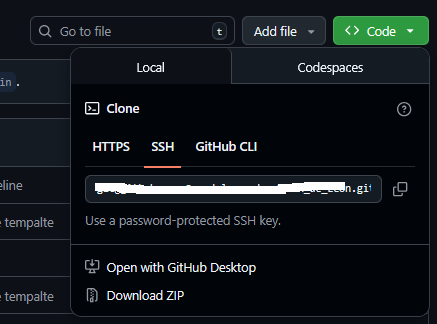
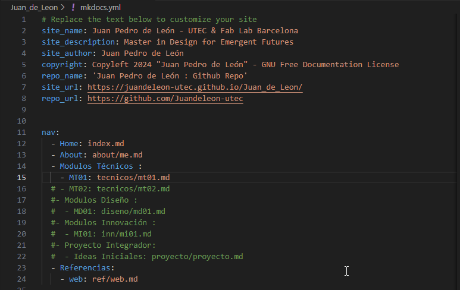
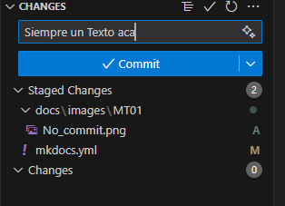

---
hide:
    - toc
---

# MT01
### Detalle del proceso de mi Git
La creacion del contenido del sitio fue utilzando los tutoriales del modulo 1 del Moodle, si ningun inconveniento, ya tengo un repositorio personal, para otras tareas, pero resolvi crear uno nuevo, para este trabajo. Auque no tengo una amplia experiencia en Git todo corrio sin inconvenientes. 
Todos los comandos corrieron sin errores,  y segun los videos pude entender la arquitectura de Git para la utilizacion de esta modalidad. 
#### SSH De mi GIT
**Imagen de la personalizacion de mi GIT**

#### Este es mi archivo Personanizado de Mkdocs

Error de Visual Studio que no muestra nada, solo no actualiza.
Cuando se le da publicar pero no se pone un texto como en la imagen siguiente, no da error, pero tambien no funciona, queda "colgado"  

