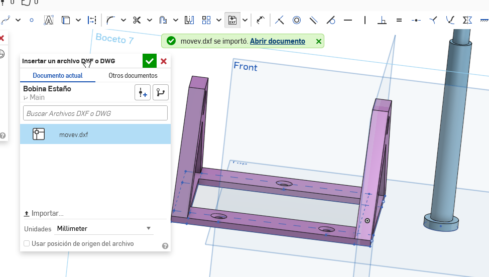
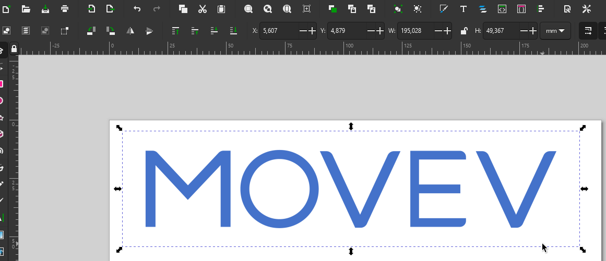
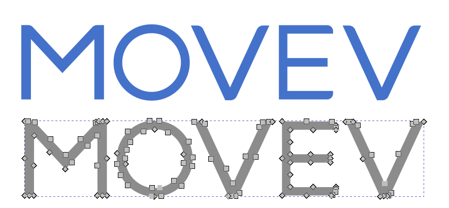
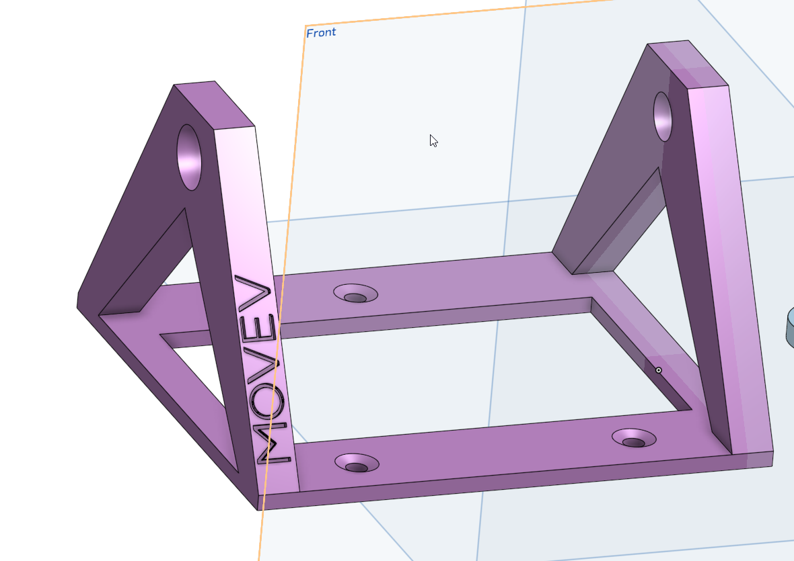
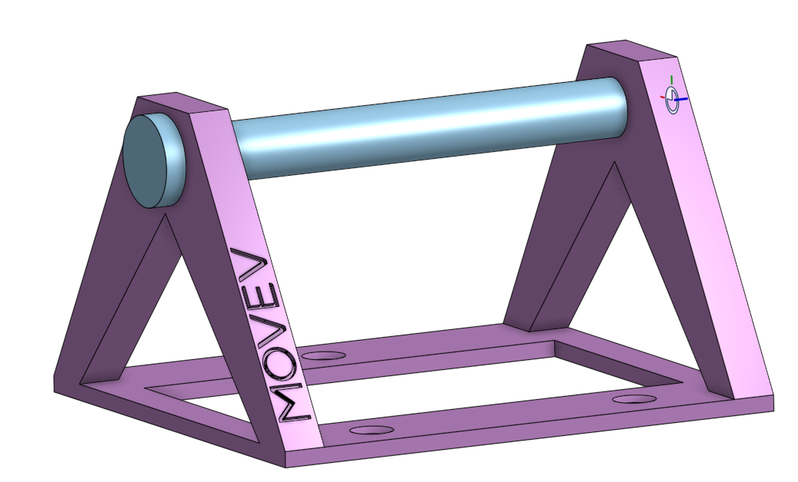
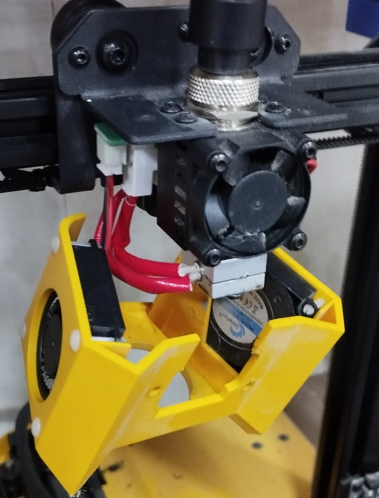
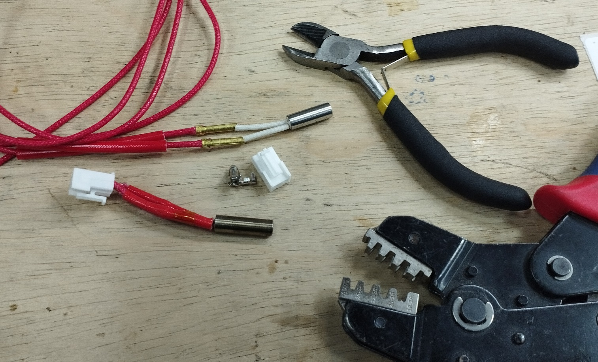
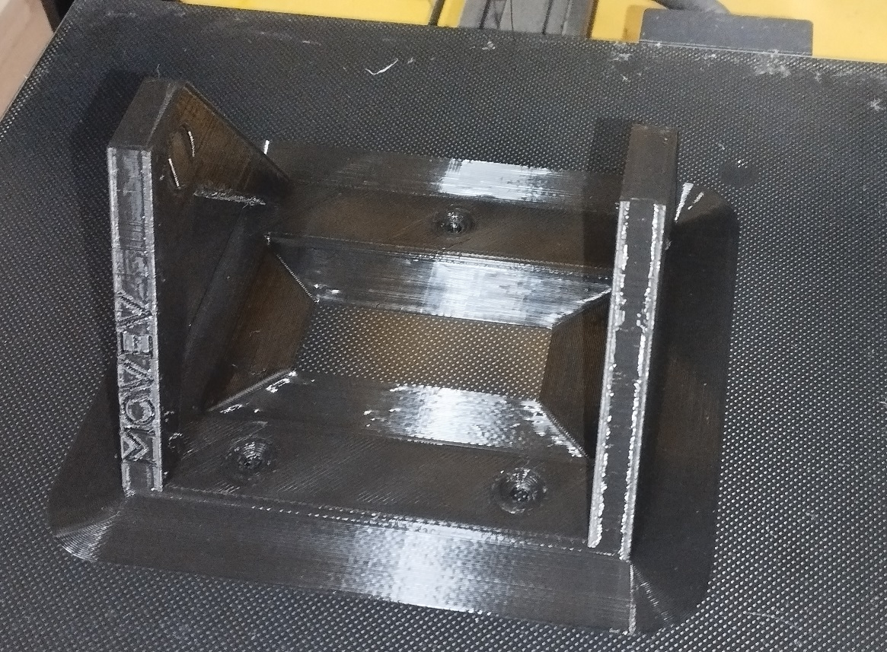
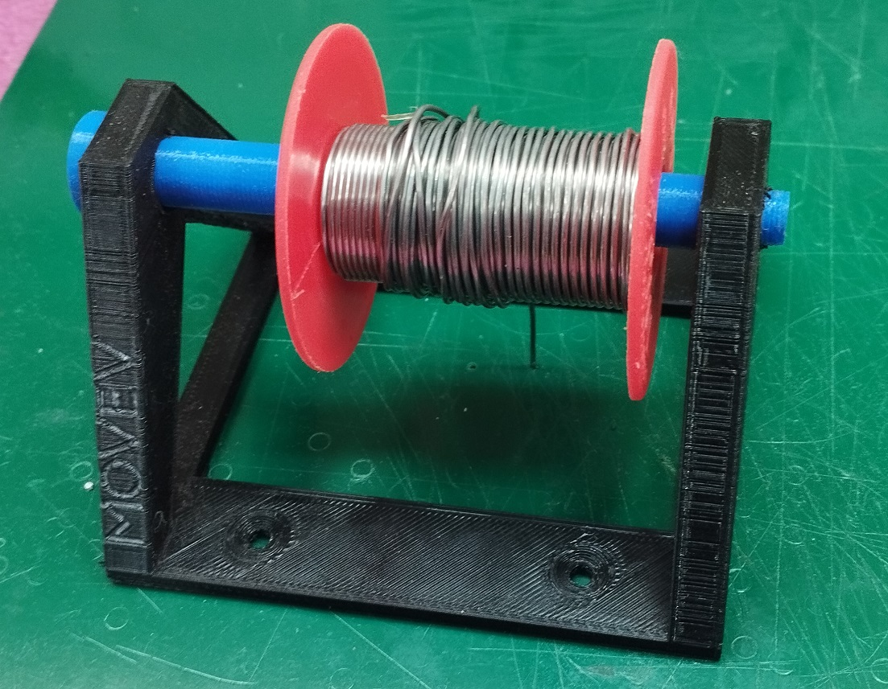

# Modulo 2 EFDI

# MT02
### Detalle del proceso de mi Git
Decidi crear un soporte para bobinas de estaño, era algo que estaba necesitando ya que me dedico entre otras cosas al armado e placas PCB de circuitos electronicos. 
El link del trabajo esta en : 
https://cad.onshape.com/documents/e352aafb45a1c5c31168a2ec/w/b7b164fd62a8d85c3b08dbd7/e/9c6f652405c27facf878e5c3?renderMode=0&uiState=68d87294ba00ea906c22779c

### Adjunto algunas fotos de proceso en ONSHAPE

### Utilizacion de InkScape
Despues de crear el modelo tome un logo en formato PNG y lo pase a vector, para luego convertirlo en DXF e importarlo desde ONSHAPE
 
**Importamos el logo a Inskcape**

**Lo convertimos a Vectores y luego a DXF**
 

**Importamos la imagen a ONSHAPE**
 

Al tratar de imprimir el modelo fisico surgio el probema... 
Al tratar de imprimir la impresora informa error de temperatura en la boquilla, al revisar el cartucho calefactor estaba quemado, por lo que fue necesario subsituir  

 
Despues de hacer el cambio ya se pudo seguir con la impresión... 

### Listo para uso!!!
