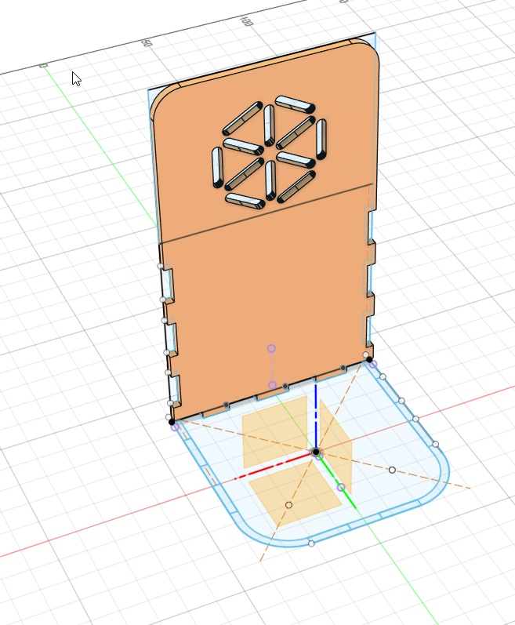
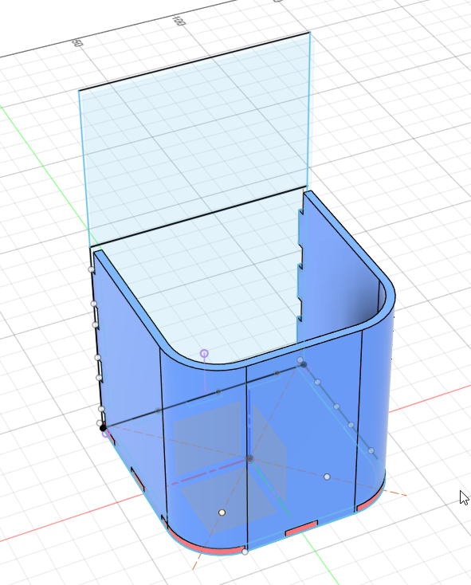
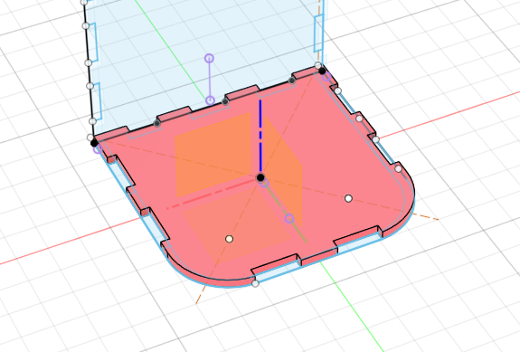
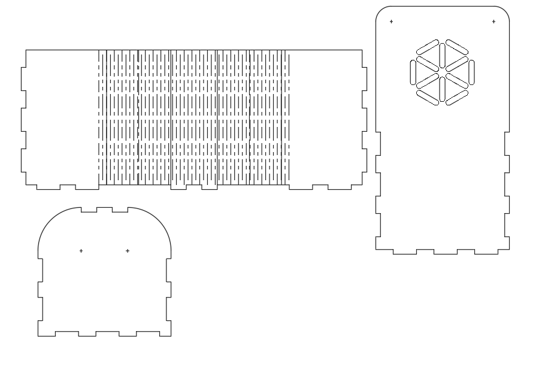
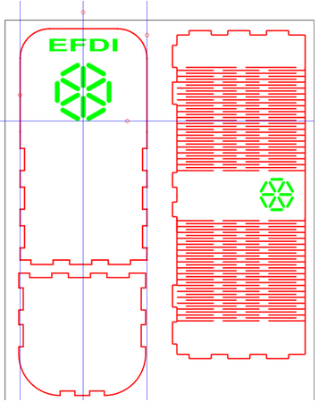
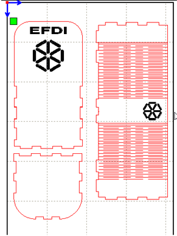

---
hide:
    - toc
---

# MT03
### Detalle del proceso de mi Git de un porta Lapices en Fusion 360.
Hastas el momento, tetrico. Fusion estudiantil, tiene limitaciones que podrian solucionar de manera facil el trabajo, ademas como estoy utilizando kerf bending el dibujo tiene curvas................terrible hasta el momento. 
22-10-2025 
## Actualizacion del pryecto 07-11-2025 - Finalizadp

# Ejercicio MT03 – Diseño y Fabricación Láser  
### Objeto: Portalápices con técnica de *kerf bending*

## Introducción

El objetivo de este trabajo fue diseñar y fabricar un objeto tridimensional para corte láser, compuesto por al menos tres piezas encastrables, parametrizable, y que incluyera las tres operaciones básicas de la máquina: **corte vectorial**, **grabado lineal** y **grabado raster**.  

Decidí realizar un **porta lápices**, ya que es un objeto simple, útil y funcional, ideal para mis primeros pasos en el diseño 3D y el uso de herramientas de fabricación digital.

## Investigación y referencias

Antes de comenzar, investigué ejemplos de **kerf bending**, una técnica que permite curvar materiales rígidos como MDF o cartón mediante cortes repetitivos.  

Analicé distintos patrones de encastre y ajustes paramétricos en **Fusion 360**, para adaptar el diseño al material de **3 mm de espesor** requerido.  

Revisé todos los videos y materiales del curso, además de visualizar otros contenidos relacionados con **Fusion**, **corte láser** y **kerf bending**.  

Busqué referencias de **diseños modulares y minimalistas**, y revisé distintos estilos de porta lápices personalizados con grabado láser.

## Proceso de diseño

### 1. Modelado 3D
Comencé el trabajo en **Fusion 360**, donde diseñé el modelo completo del porta lápices con tres piezas principales encastrables.  
Definí como parámetro el **espesor del material (3 mm)**, lo que permitió ajustar automáticamente las medidas en caso de cambios futuros.

### 2. Aplicación del *kerf bending*
En una de las caras incluí la técnica de *kerf bending*, lo que permitió lograr una **curvatura suave** en el diseño.  

Según pude apreciar en los videos del curso, para la curvatura que necesitaba, una distancia de **2.5 mm** teóricamente ya funcionaría bien.  
Sin embargo, para evitar retrabajos en el momento de corte, preferí realizar un corte de **2 mm**, que aunque deja la pieza un poco más frágil, no afecta el diseño y permite una mejor curvatura.

Mirando al detalle , despues de ver los errores, como dicen con carta vista es mas facil, pero ehi se notan las lineas que generaro este problema:

### 3. Incorporación de grabados y texto
Agregué **logos vectoriales** (como el de UTEC, en formato PNG) y **textos grabados**.  
Al principio los realicé en **Fusion**, pero al exportar a **DXF** e importar en **Inkscape**, descubrí que era mejor realizar el grabado en esta etapa por la **variedad de fuentes disponibles**.

De esta forma combiné las tres operaciones de la máquina láser:

- **Corte** de las piezas principales  
- **Grabado vectorial** para líneas finas  
- **Grabado raster** para logos  

### 4. Preparación para el corte
Realicé el **nesting** de las piezas dentro del área de trabajo de formato **A4**, respetando las limitaciones del ejercicio.  

Exporté el diseño final en formato **.dxf** y lo llevé al software **RDWORKS V8** para asignar las propiedades correspondientes a cada capa y color según el tipo de operación.  

El sistema reconoció correctamente los formatos y capas exportadas desde Inkscape.

## Resultados

El porta lápices se pudo **ensamblar correctamente sin adhesivos**, cumpliendo con los requisitos del ejercicio.  

Durante el **primer intento de corte**, algunas líneas no se grabaron correctamente, lo que me llevó a revisar los espesores y configuraciones de capa.  
Esa experiencia me permitió **detectar y corregir errores comunes** en la preparación del archivo.

En el **segundo intento**, el corte fue exitoso y el resultado final fue **funcional y estéticamente agradable**, demostrando la utilidad del diseño paramétrico y la técnica de curvado.

## Dificultades y aprendizajes

- En el primer corte detecté errores en la configuración de líneas de grabado, lo que me obligó a revisar la estructura de capas y colores.  
- Aprendí a **parametrizar correctamente el espesor del material**, evitando reajustes manuales.  
- Tuve varios inconvenientes con **Fusion 360**, especialmente en las exportaciones, lo que casi invalida todo el trabajo.

## Archivos del proyecto

Dentro del archivo `.zip` se incluyen:

- **Archivo 3D original:** - [Modelo 3D – Fusion 360](../images/MT03/porta_lapices_v1.f3d)
- **Archivo vectorial para corte (Inkscape):** [Modelo 2D – InkScape](../images/MT03/porta_lapices_v1.dxf)
- **Archivo de corte (RDWORKS):** [Modelo 3D – RDWORKS](../images/MT03/porta_lapices_v1.rld)
- **Imágenes del proyecto:** 
    - [09-isotipo UTEC](../images/MT03/09-Isotipo.png)
    - [Lapicero parte 1](../images/MT03/LAPICERO_PARTE_1.png)
    - [Lapicero parte 2](../images/MT03/LAPICERO_PARTE_2.png)
    - [Lapicero parte 3](../images/MT03/LAPICERO_PARTE_3.png)
    - [Lapicero parte 4](../images/MT03/LAPICERO_PARTE_4.png)
    - [Lapicero parte 5](../images/MT03/LAPICERO_PARTE_5.png)
    - [Lapicero parte 6](../images/MT03/LAPICERO_PARTE_6.png)
    - [Desde 0 todo otra vez](../images/MT03/desde_0_todo_otra_vez.png)
    - [Fusion360](../images/MT03/fusion360.png)
    - [Inkscape](../images/MT03/inkscape.png)
    - [Rdworksv8](../images/MT03/rdworksv8.png)
    - [Kerf partido](../images/MT03/kerf_partido.jpg)
    - [Partes final](../images/MT03/partes_final.jpg)
    - [Final armado](../images/MT03/final_armado.jpg)
- **Material:** MDF de 3 mm  
- **Dimensiones totales:** Formato A4  

## Reflexión personal

La técnica de **corte láser** me pareció sumamente interesante. Aunque no es mi foco principal en el posgrado y aún no tengo claro cómo aplicarla en el, me llama la atención la **variedad de posibilidades creativas** que ofrece.  

Comprender una técnica nueva amplía el abanico de opciones de desarrollo, tanto profesional como académico.  

Por otro lado, **Fusion 360** me resultó un software complejo y poco intuitivo. Los errores no son claros, muchas funciones exportan resultados inconsistentes, y la detección de problemas no es evidente.  
Seguramente se deba a mi falta de experiencia, pero considero necesario realizar un **curso rápido** sobre la herramienta para aprovecharla mejor sin tantos contratiempos.

