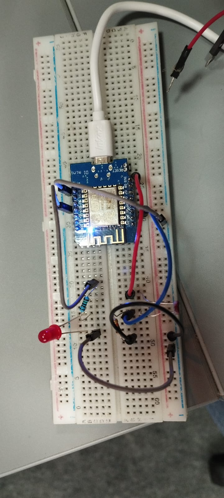

---
hide:
    - toc
---

# MT04
## Tarea 5 – Detector de “Llama” Simulado con Respuesta de Emergencia
### Actualizacion del pryecto 22-11-2025 - Finalizado

## Introducción

 En esta actividad vas a simular la detección de una llama usando la fotoresistencia y generar una respuesta de emergencia: encender luces y mover un actuador que simula apagar el fuego. 

**Descripción general**

    - Ubicar la fotoresistencia cerca de la zona a monitorear.
    - Detectar un aumento brusco de luz respecto del nivel ambiente y considerarlo como “llama detectada”.
    - Al detectar la “llama”, encender varios LEDs como alarma visual.
    - El servo (o un motor DC si cuentan con controlador adecuado) gira para simular un mecanismo que intenta “apagar” el fuego.
    - El botón sirve para resetear el sistema y volver al estado de vigilancia.

## Investigación y referencias

Para utilziar una esp8266 desde la ide de Arduino necesitamos algunas cosas.
    1 El ide de Arduino, de preferencia en su versión mas reciente.
    2 Instalar los controladores de los driver CH340 para el Wemos
    3 Los controladores del esp8266 para arduino.

La informacion relevante esta en :
   - https://www.arduino.cc/ 
   - https://www.wemos.cc/en/latest/d1/index.html
   - https://www.wemos.cc/en/latest/tutorials/d1/get_started_with_arduino_d1.html

### Materiales para el desarrollo
Arrmar el circuito electrico para tener una idea de los materiales y las conexiones que deben existir entre ellos. Para el caso del circuito utilice un software OpenSource llamado Kicad, que ademas de permitir hacer los esquemas electricos permite armar y diselar PCB y exportar en Gerber directo para la produccion en masa. https://www.kicad.org/

**Materiales utilizados**
    - Protoboard
    - Cables varios
    - Resistencia LDR
    - Resistencias de 10K y 240ohm
    - Servo SG90
    - 1 Led Rojo

**Circuito armado sin el servo**

**Test de reconocimiento de luminocidad**

**Test de respuesta  de luminocidad**
Teste del led ente el cambio de luminocidad
<iframe width="560" height="315" src="https://www.youtube.com/embed/Hm8ThlOeCjA?si=2o5bn_ZfuPHY7BwF" title="YouTube video player" frameborder="0" allow="accelerometer; autoplay; clipboard-write; encrypted-media; gyroscope; picture-in-picture; web-share" referrerpolicy="strict-origin-when-cross-origin" allowfullscreen></iframe>

