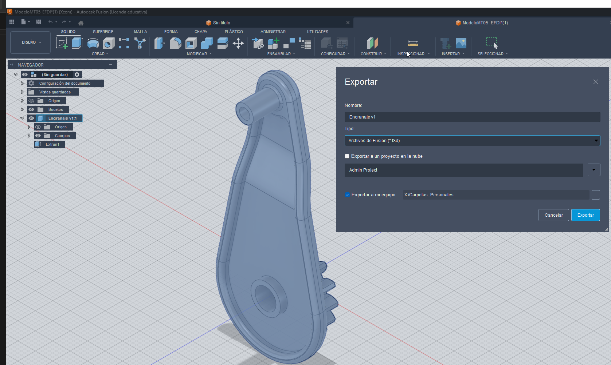
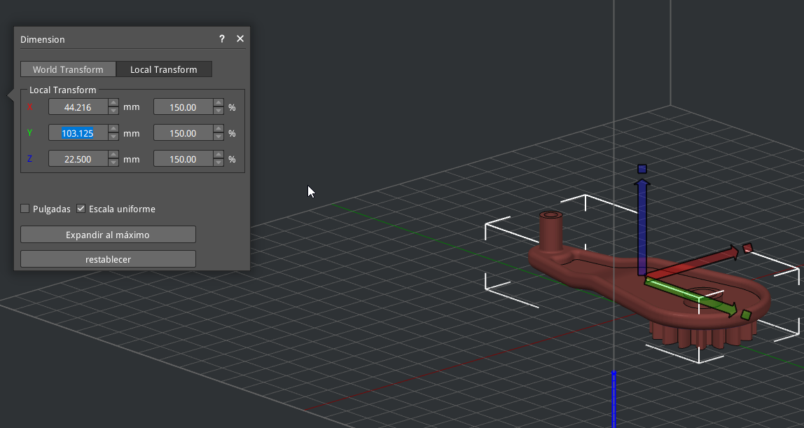
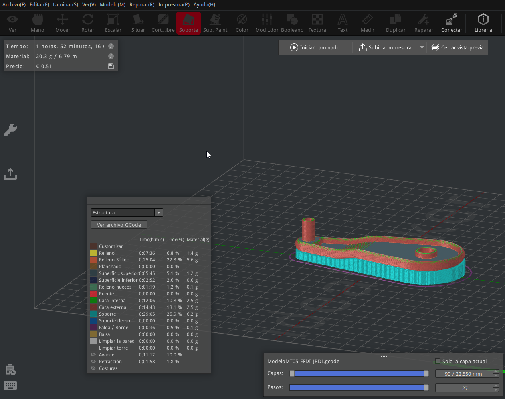
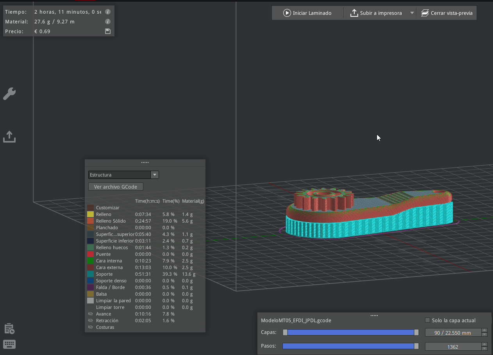
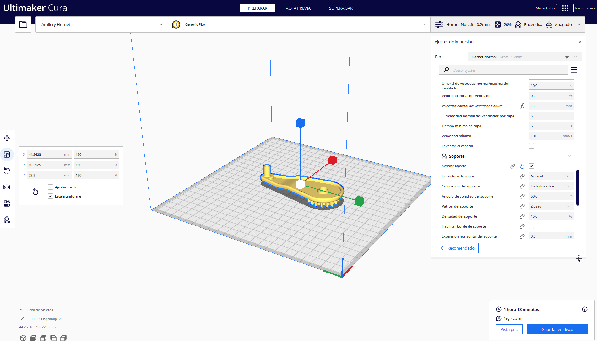

# Práctica 5: Preparación de modelo para impresión 3D (Slicing en IdeaMaker)

### Estado: Actualizado el Fecha: 14-12-2025
**Introducción**

El objetivo de este ejercicio fue experimentar con el flujo de trabajo de pre-impresión (slicing), preparando un archivo de diseño para la impresora Raise Pro2 Plus utilizando el software ideaMaker.

Más allá de cumplir con el requerimiento básico, mi enfoque fue analizar cómo las decisiones de orientación afectan la eficiencia de la impresión (tiempo y material de soporte) y contrastar este flujo de trabajo industrial con uno doméstico utilizando Ultimaker Cura. Entiendo que la comparación es puramente personal, sin enfasis en hacer un estudio de caso, ya que nunca e trabajado con una impresora Raise Pro 2, y mi impresora que si tengo conocimeinto de como utilizar es una Artillery Hornet(netamente para bricolage).

 
Para asegurar una configuración adecuada, utilicé los siguientes recursos y herramientas:

    Modelo 3D: Archivo provisto en formato .f3d, convertido a .stl. mediante Fusion 360

    Software de Lamilado: ideaMaker (para Raise3D) y Ultimaker Cura (para contraste).

    Hardware Simulado: Raise Pro2 Plus (Laboratorio) y Artillery Hornet (Personal).

    

Desarrollo y Análisis de Orientación
1. Preparación del Archivo

Inicié el proceso exportando el modelo desde Fusion 360 en formato .STL (binario). 

**Primero abrimos en Fusion 360 para exporta como STL**  

2. Una vez exportado de Fusion, pasamos a  importarlo en ideaMaker, realicé el escalado solicitado al 150%. Tambien ser realizo una reorientacion del modelol.

**Expandir 150% el dibudo desde IdeaMaker**  

3. Se utilizo la obcion de laminado sugerida por el documento del trabajo y asigné el Extrusor Izquierdo, y demas parametros. Y se pasa a laminar el objeto, obteniendo la imagen a continuacion. Como prueba de concepto se toma el tiempo por defecto y se sacan algunas medidas del tipo:
**Tiempo total del laminado:** 1 Hora y 52 Minutos aproximadamente. 
**Gramos de Material Gasto:** 20.3 Gramos

**Primera exportacion del Modelo en Gcode y analisis de tiempos**  

4. Luego de este laminado y a nivel comparativo se vuelca la pieza sobre uno de sus ejes 180 grados y se procede a laminar nuevamente. En base a la experiencia de impresion 3D la cantidad de soportes generados puede influir ampliamente en el tiempo y la cantidad de material empleado. Para este Segundo laminado obtuvimos estos valores.
**Tiempo total del laminado:** 2 Hora y 11 Minutos aproximadamente. 
**Gramos de Material Gasto:** 27.6 Gramos

**Segundo Laminado en Gcode**  

**Parametros del GCODE**  

5. Estudio Comparativo de Orientación (Iteraciones)

Al realizar algo tan simple como rotar la figura es evidente la diferencia en tiempo y principalmente en el consumo de material. Utilizando en ambos casos exactamente la misma configuracion de soportes y velocidad

    Opción A (Posición 1): 

        Observación: Esta posición requirió **Menos** estructuras de soporte debido a la complejidad de los voladizos.

        Tiempo estimado: 2h:11.

    Opción B (Posición 2):  

        Observación: En esta orientación, la generación de soportes fue **Mayor** .  

        Tiempo estimado: 1h:52m

Auque relativicemos el tiempo llevando a porcentajes la segunda pocicion demora 18%, mas de minutos para realizar la impresion, el consumo de material si fue notorio al consumir 33% mas de este.

Decisión Final: En este modelo en concreto la opcion **A** es mas eficiente en tiempo y material. Why (Justificación): Esta orientación demostró ser más eficiente, reduciendo el desperdicio de material de soporte y optimizando el tiempo de máquina sin comprometer la estabilidad de la pieza.
 

6. Exploración Adicional: Contrastando con Ultimaker Cura

Para profundizar en mi aprendizaje, decidí replicar el ejercicio utilizando mi propia impresora, una Artillery Hornet, y el laminador Ultimaker Cura.

Objetivo: Verificar si las estimaciones de tiempo y la generación de soportes variaban drásticamente entre un ecosistema cerrado (Raise3D) y uno abierto (Marlin/Cura).

Trabajo: Se siguieron exactamente los mismos pasos que en el trabajo anterior, aumentar la figura al 150%.

Hallazgo: Es imposible no notar la diferencia en eficiencia entre en laminado con CURA y IdeaMaker.   

**Tiempo total del laminado:** 1 Hora y 18 Minutos aproximadamente.   
**Gramos de Material Gasto:** 19 Gramos.  

**Eficiencia:**  tomando como base el mejor tiempo de IdeaMaker  **30%** mas rapida y cerca de **7%** menos consumo de material

**Laminado del  Gcode en CURA para Artillery Hornet**  

**Laminado del  Gcode en CURA para Artillery Hornet**  

**Reflexión Personal**

1. Este ejercicio cambió mi perspectiva sobre el "Slicing". Antes lo veía como un paso automático, pero al comparar las dos orientaciones, entendí que es una fase de toma de decisiones estratégicas. El simple hecho de rotar la pieza no solo ahorró tiempo (como se ve en la comparativa), sino que reduce el riesgo de fallos por soportes mal adheridos. Además, comparar ideaMaker con Cura me ayudó a entender que, aunque las interfaces cambian, la lógica de fabricación por capas (FDM) es universal.  
2. Otra de las reflexiones personales que obtuve fue que conocer el hardware con que trabajamos nos ofrece una ventaja significativa, entiendo que las impresoras en UTEC tienen lo que se podria decir un estilo mucho mas profesional, pero parece en principio que una impresora casera y un laminador generico son extremadamente mas eficientes. Cosa que entiendo carece de sentido lógico, por lo que concluyo que el mi conocimiento del hardware que tengo y sus prestaciones es un componente fundamental para llevar adelante estos trabajos.

**Archivos del Proyecto**

Los archivos resultantes y las evidencias del proceso están disponibles en el repositorio:

Modelo STL: https://github.com/Juandeleon-utec/Juan_de_Leon/blob/main/docs/anexos/mt05/Engranajev1.stl   
Código G (Raise3D): https://github.com/Juandeleon-utec/Juan_de_Leon/blob/main/docs/anexos/mt05/Juan_Pedro_de_Leon.gcode   

Código G (CURA-ARtillery): https://github.com/Juandeleon-utec/Juan_de_Leon/blob/main/docs/anexos/mt05/Juan_Pedro_de_Leon_Cuda.gcode

