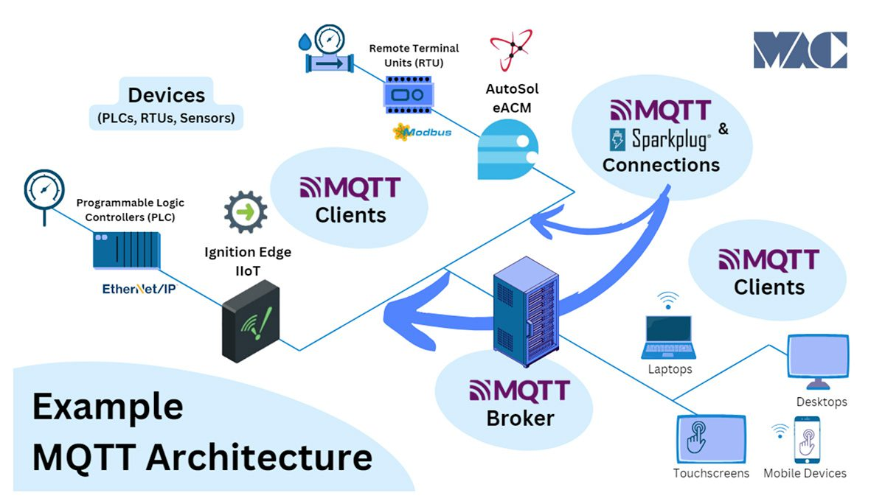
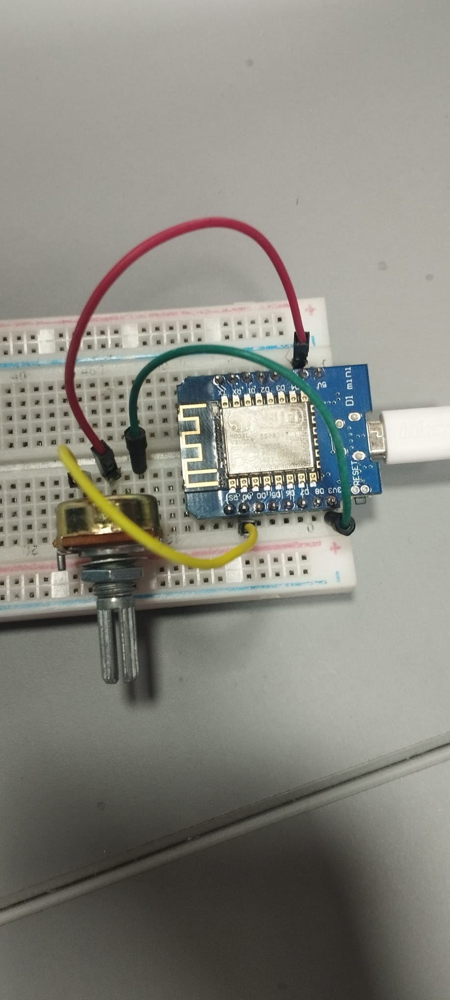
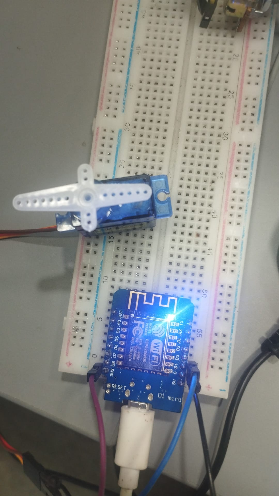
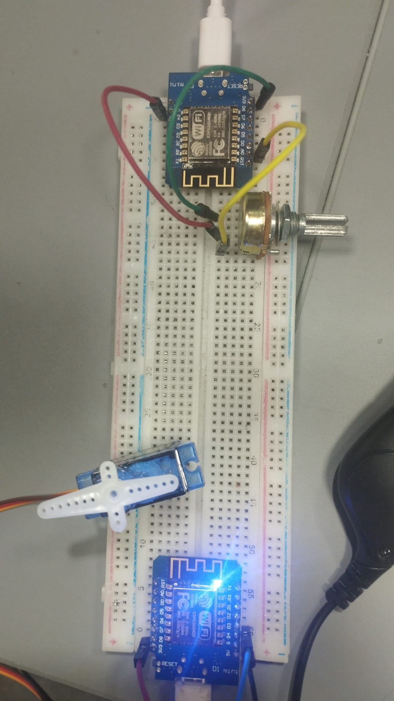
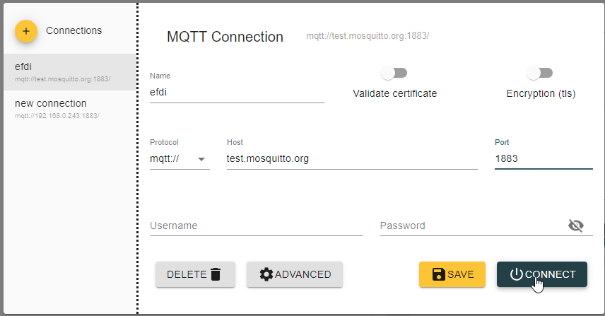
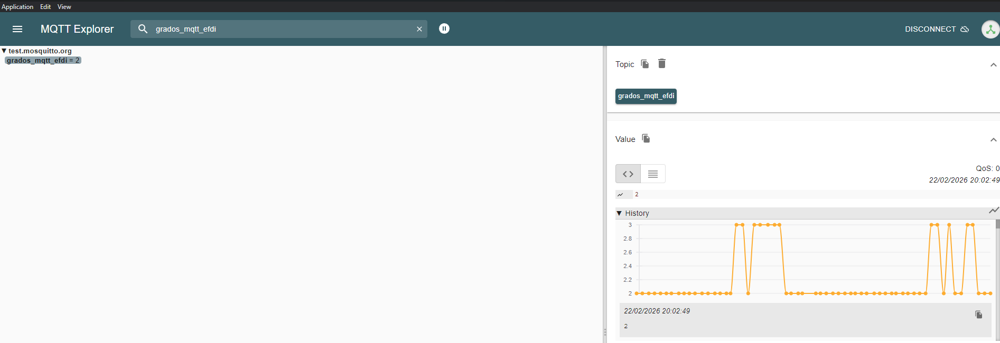

# 📡 Control de Servo Remoto vía MQTT (ESP8266)

Este proyecto implementa una arquitectura de comunicación IoT entre dos nodos **Wemos D1 Mini**. Un nodo actúa como emisor (sensor) leyendo la posición de un potenciómetro, y el segundo como receptor (actuador) controlando un servomotor SG90.

La idea de este proyecto es utilizar la comunicación entre dispositivos; para mi caso particular, la implementación de prueba se realiza en cercanía, pero podrían ser dispositivos geográficamente muy lejanos.

---

## Tabla de Contenidos
- [Introducción](#introducción)
- [Arquitectura del Sistema](#arquitectura-del-sistema)
- [Hardware Requerido](#hardware-requerido)
- [Esquemas de Conexión](#esquemas-de-conexión)
- [Código Fuente](#código-fuente)
- [Reflexión y Mejoras](#reflexión-y-mejoras)

---

## 1. Introducción

### **¿Qué hace este proyecto?**
El sistema simula una barrera o control remoto industrial, utilizando la información del movimiento de una perilla (potenciómetro) para transmitir dicha posición a un servo.
1. **Wemos A:** Realiza lecturas analógicas de un potenciómetro, las convierte a grados ($0-180$) y las publica en un broker MQTT.
2. **Wemos B:** Se suscribe al tópico, recibe los datos y posiciona un servo **SG90** inmediatamente.

### **¿Por qué MQTT?**
* **Desacoplamiento:** Los dispositivos no necesitan conocer sus IPs internas. Además, no tiene restricciones de distancia: el potenciómetro podría estar en Rivera y el servo en Montevideo, sin que existiera una latencia apreciable. Cabe destacar que, al utilizar un broker público, la estabilidad es subjetiva.
* **Escalabilidad:** Se pueden añadir más servos suscribiéndolos al mismo tópico.
* **Estándar Industrial:** Es el protocolo líder en IoT debido a su bajo consumo de ancho de banda.

---

## 2. Arquitectura del Sistema

El sistema utiliza un **Broker Público** para la mensajería:
* **Servidor:** `test.mosquitto.org`
* **Puerto:** `1883`
* **Tópico:** `grados_mqtt_efdi`

---

## 3. Hardware Requerido

| Cantidad | Componente | Función |
| :--- | :--- | :--- |
| 2 | Wemos D1 Mini (ESP8266) | Microcontroladores WiFi |
| 1 | Potenciómetro 10kΩ | Sensor de posición |
| 1 | Servo SG90 | Actuador final |
| 2 | Cables USB | Conexión a PC/Alimentación |
| - | Jumpers y Protoboard | Conexiones físicas |

---

## 4. Esquemas de Conexión

### **Dispositivo A (Emisor)**
* **VCC (3.3V)** -> Alimentación vía USB.
* **GND** -> Pin lateral del potenciómetro.
* **A0** -> Pin central del potenciómetro.

### **Dispositivo B (Receptor)**
* **D4 (GPIO2)** -> Señal del servo (Naranja).
* **5V Externo** -> Alimentación vía USB.
* **GND** -> GND del servo (Marrón) + GND del Wemos (Masa común).

---

## 5. Código Fuente y Funcionamiento
 
Los archivos de código fuente para el entorno de Arduino IDE se encuentran en las siguientes rutas:

* 📥 [**Código Emisor (Wemos A)**](../anexos/mt06/wemos_2_potenciometro.ino): Lee el potenciómetro y publica vía MQTT.
* 📥 [**Código Receptor (Wemos B)**](../anexos/mt06/wemos_1_Servo.ino): Recibe datos del tópico y mueve el servo.

### **5.1 Pruebas con MQTT Explorer**
Para revisar el funcionamiento del envío de datos se utilizó **MQTT Explorer**, un software de código abierto que permite conectarse desde el sistema operativo al broker para monitorear nuestro tópico. De esta manera, se analizó si el Wemos responsable de publicar los datos lo estaba haciendo correctamente.

Como se aprecia en la imagen 2, los datos se reciben correctamente. Posteriormente, se procedió a realizar la prueba de conexión del segundo Wemos con el servo.

---

## 6. Reflexión Personal y Aprendizajes

Durante el desarrollo se identificaron los siguientes puntos críticos:
* **Gestión de Energía:** El servo SG90 genera ruido eléctrico; se recomienda una fuente externa para evitar reinicios en el Wemos. Al alimentarlo únicamente por el cable USB, se generan oscilaciones indeseadas en el movimiento.
* **Latencia:** El uso de brokers públicos presenta un ligero retraso (ping), aunque es aceptable para aplicaciones que no sean de misión crítica.
* **Robustez:** Se implementó una función de reconexión automática tanto para la red WiFi como para el cliente MQTT.

---

## 🛠️ Herramientas Utilizadas
* **IDE:** Arduino IDE 2.1.0
* **Librerías:** `PubSubClient`, `Servo` (específica para ESP8266).
* **Broker:** Mosquitto.
* **Documentación:** Markdown editado y corregido con asistencia de IA.