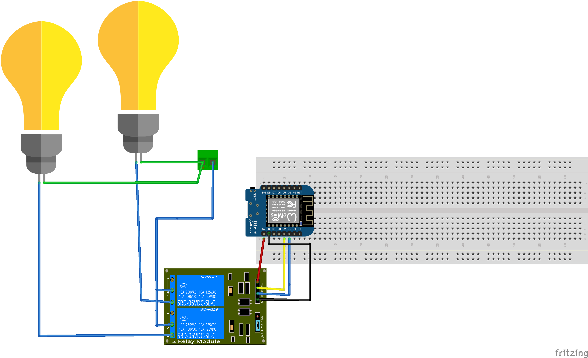
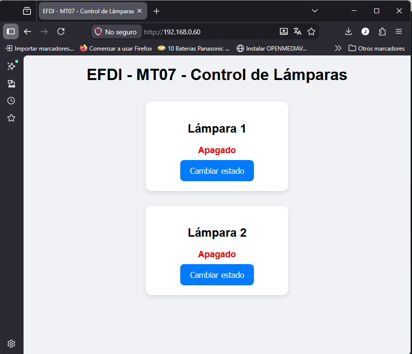
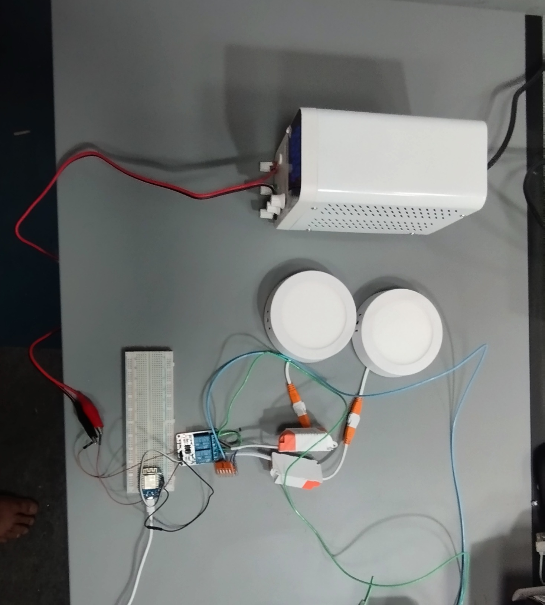
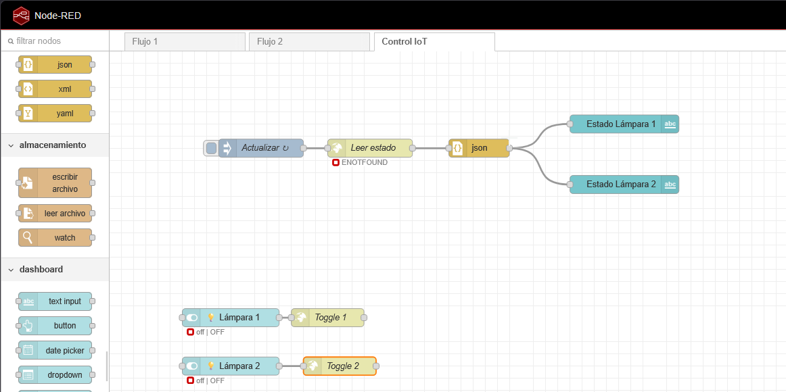
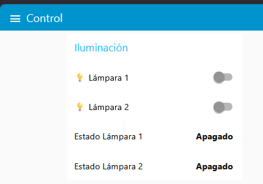

# MMT07– Interfaces y aplicaciones
## Control de Relé desde Interfaz Web (ESP8266)

### Introducción

En este proyecto se diseñó e implementó una interfaz de control para un sistema embebido basado en un microcontrolador ESP8266 (Wemos D1). La idea principal fue pasar de un sistema que funciona únicamente a nivel de código o hardware, a uno que pueda ser operado por cualquier usuario mediante una interfaz clara y accesible.

Más allá del resultado final, el foco estuvo en comprender cómo se construye el “puente” entre el usuario y el sistema físico. Es decir, cómo una acción simple en una interfaz (como presionar un botón) se traduce en un cambio real en el mundo físico (activar un relé).

### Objetivo del proyecto

El objetivo fue desarrollar un sistema que permita:

* Controlar un actuador desde una interfaz accesible
* Visualizar el estado actual del sistema en tiempo real
* Implementar una comunicación clara entre cliente (navegador) y servidor (ESP8266)

Se buscó mantener una solución simple, pero lo suficientemente completa como para reflejar un caso real de IoT.

### Actuador seleccionado

Se decidió trabajar con un **módulo relé**, acompañado de un LED como indicador visual. 

El relé es un componente interesante porque permite controlar cargas externas (por ejemplo, una lámpara o un motor), lo que lo convierte en un elemento muy utilizado en automatización. En este caso, se utilizó principalmente como demostración de control.

Se opto por un rele para simular de manera mas realista una implementacion de IOT para domótica, que fue el enfoque que le di a este trabajo. 
Los actuactodes del tipo rele pueden manejar pequeñas cargas a 220V como para encender una lampara por ejemplo.

* Relé activado → Lampara encendida
* Relé desactivado → Lampara apagada

Lo mismo se repite para las dos cargas.

### Interfaz utilizada

**Primero se abordara el metodo clasico, todo dentro del esp32**

Se implementó una interfaz web utilizando **HTML y aldo de JavaScript** para darle un poco mas de "color", servida directamente desde el ESP8266.

Se optó por esta solución por varias razones:

* No requiere instalar software adicional
* Es accesible desde cualquier dispositivo con navegador
* Permite implementar interacción de forma sencilla

La interfaz incluye:

* Dos botones: “Encender” y “Apagar”
* Un indicador de estado dinámico
* Actualización automática del estado (sin recargar la página)

Aunque visualmente es simple, conceptualmente ya introduce elementos clave de una interfaz IoT: acciones claras, feedback inmediato y legibilidad del estado.

### Comunicación entre la interfaz y el ESP8266

La comunicación se realiza mediante el protocolo **HTTP**, utilizando un modelo cliente-servidor.

El ESP8266 actúa como servidor web y expone distintos endpoints:

* `/` → devuelve la página HTML
* `/on` → activa el relé
* `/off` → desactiva el relé
* `/estado` → devuelve el estado actual

Desde el lado del navegador, se utiliza `fetch()` en JavaScript para enviar solicitudes HTTP al microcontrolador.

Un detalle interesante es que el estado no se asume en la interfaz, sino que se consulta periódicamente (cada segundo). Esto evita inconsistencias y asegura que lo que se muestra corresponde al estado real del hardware.

###  Funcionamiento general del sistema

El flujo completo del sistema es el siguiente:

1. El usuario se conecta a la red WiFi donde está el ESP8266
2. Accede a la dirección IP del dispositivo desde el navegador 
3. Se carga la interfaz web
4. El usuario presiona un botón (Encender o Apagar)
5. El navegador envía una solicitud HTTP al ESP8266
6. El microcontrolador procesa la orden
7. Se activa o desactiva el relé.
8. La interfaz consulta el estado y actualiza la información mostrada

Este flujo refleja claramente la separación entre interfaz, lógica y hardware, que es uno de los conceptos centrales del módulo.

### Herramientas y tecnologías utilizadas

Durante el desarrollo se utilizaron las siguientes herramientas:

* **Arduino IDE** → programación del ESP8266
* **ESP8266 (Wemos D1)** → microcontrolador principal
* **HTML** → estructura de la interfaz
* **JavaScript** → interacción y comunicación
* **Módulo relé de 2 canales** → actuador
* **Dos plafones LED de 220V** → Dispositivo final

Se eligió este conjunto por su simplicidad y disponibilidad, permitiendo enfocarse más en el concepto de interfaz que en la complejidad técnica.

### Decisiones de diseño

Una de las decisiones principales fue utilizar una interfaz web en lugar de otras opciones como Blynk o Node-RED.

Esto se debe a que:

* Permite entender mejor cómo funciona la comunicación
* Da mayor control sobre la implementación
* Es más transparente desde el punto de vista educativo

También se decidió mantener una interfaz simple, priorizando la claridad sobre el diseño visual complejo. Esto está alineado con las buenas prácticas vistas en el módulo, donde se prioriza la legibilidad y la coherencia.

### Prube de funcioanmiento
Acá se muestra como quedo la interfaz web y el modulo funcioando:

**Ahora con Node-RED**

A modo de test, implemente la solucion con Node-red tambien, probar las dificultades del mecanismo. 

El flujo de trabajo y el Dashboard quedaron armados de esta mandera:

Dejo un pequeño video de Node-red controlado el ESP8266 :
Como ventaja es mas vistoso, creo que es aplicable en un centro de control integrado, en el cual pueda controlar varios dispositivos distintos, caso contrario, como e este ejemplo o en el de utilizar solo 1 dispositivo, no me quedo claro la ventaja en un aún.

No practique demasiado como para tener una idea clara, ademas de dificultades importantes encotradas en la implementacion que detallare a continuación.

###  Dificultades encontradas

Durante el desarrollo surgieron algunas dificultades interesantes:

* Entender el flujo cliente-servidor
* Sincronizar correctamente el estado entre hardware e interfaz
* Manejar múltiples solicitudes HTTP de forma ordenada
* El Whemos D1 mini, por mas que tenga una salida 5V la misma no brinda carga suficiente para alimantar el Rele, por lo que se opto por una fuente externa.
* Una dificultad particular fue evitar que la interfaz muestre un estado incorrecto. Esto se resolvió implementando un endpoint específico (`/estado`) y consultándolo periódicamente desde el navegador.
* Sugiero bajar la versin 22.2 de node, con la ultima version me fue imposible hacer que funcionara el DASHBOARD, aunque dice que es compatible, no fue posible hacerlo funcionar adecuadamente.

### Reflexión personal

Este proyecto permitió ver claramente cómo una interfaz cambia completamente la forma en que se interactúa con un sistema.

Algo que al principio era simplemente “encender un pin” desde el código, pasó a convertirse en un sistema controlable desde cualquier dispositivo. Esto acerca mucho más el desarrollo a aplicaciones reales.

También quedó claro que diseñar una interfaz no es solo “hacer botones”, sino pensar en cómo el usuario entiende y utiliza el sistema.

### Archivos del proyecto

En este repositorio se incluyen:

* Código fuente (.ino) [Ver código (ARDUINO)](https://juandeleon-utec.github.io/Juan_de_Leon/main/anexos/mt07/iot_reles/iot_reles.ino)

* Esquema eléctrico (Fritzing) [Esquema electrico en Fritzing](https://juandeleon-utec.github.io/Juan_de_Leon/main/anexos/mt07/esquemas.fzz)
* Imágenes del montaje
* Este archivo de documentación

