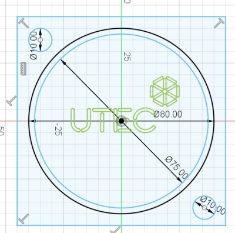
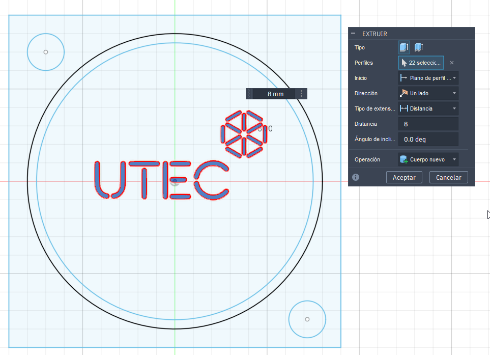
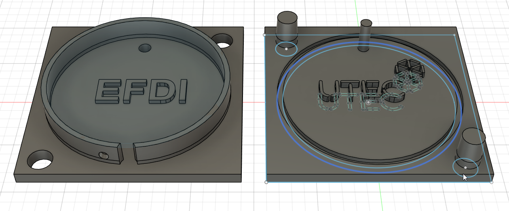
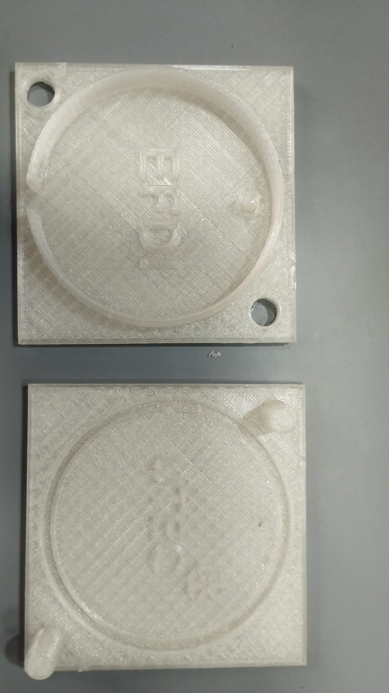

# Práctica 09: Diseño de molde para biomateriales

Diseño de molde para biomateriales
Introducción 

En este ejercicio diseñé un molde rígido de dos piezas para biomateriales, pensado para ser fabricado mediante impresión 3D y utilizado para colada de materiales de bajo espesor y con cierta flexibilidad al momento del desmolde.

El objetivo no fue únicamente obtener un objeto funcional, sino poner en práctica los criterios de diseño de moldes vistos en el módulo, considerando aspectos como:

tipo de molde (rígido, multipartes),

sistema de encastre y cierre,

criterios de llenado y desmolde,

tolerancias,

espesores,

elección de materiales y tecnologías.

La fabricación y uso del biomaterial se abordará en otra materia, por lo que en este ejercicio me concentré específicamente en el diseño del molde como herramienta.

Investigación y referencias 

Antes de comenzar el diseño repasé los conceptos trabajados en el módulo sobre:

 - tipos de moldes (rígidos vs flexibles),
 - moldes de una pieza y de múltiples piezas,
 - importancia del desmolde,
 - necesidad de sistemas de alineación,
 - relación entre geometría, material y proceso.

También tomé como referencia el ejemplo de molde para biomateriales proporcionado en la consigna, que está pensado para impresión 3D, y lo usé como guía conceptual más que como modelo a copiar literalmente.

Decidí trabajar con:

 - un molde rígido de dos piezas, porque permite definir mejor geometrías con relieves y texto, y facilita el desmolde sin dañar la pieza, en esta caso utilice PLA, ya que era el material que tenia disponible.
 - un diseño de geometría simple, para enfocarme más en los criterios técnicos que en la complejidad formal.
 - un material flexible como resultado final (biomaterial), lo cual permite cierto margen en el desmolde aunque el molde sea rígido.
 - 

#Proceso
##Diseño

El molde fue diseñado en Fusion 360 como un conjunto de dos cuerpos que encastran entre sí.

Durante el diseño tuve en cuenta:

Sistema de encastre y alineación:
Incorporé geometrías de centrado para asegurar que ambas mitades siempre cierren en la misma posición, evitando desplazamientos que generen rebabas o deformaciones.

Criterios de desmolde:
Evité socavados y diseñé ligeros ángulos implícitos en las paredes para facilitar la extracción de la pieza una vez solidificada.

Espesores:
El molde está pensado para piezas de poco espesor, por lo que la cavidad no es profunda y el cuerpo del molde mantiene un espesor suficiente para que sea estructuralmente estable durante el uso.

Textura y texto:
Incorporé relieve y/o perforaciones para experimentar cómo se reproducen detalles en el biomaterial y evaluar la fidelidad de copia.

Tolerancias:
Consideré las tolerancias propias de la impresión 3D (especialmente en FDM), dejando holguras mínimas entre las partes móviles o de encastre.
Tambien aumente la distancia entre las barras del logo de utec, ya que no tengo claro cual sera la viscosidad del bioplastico utilizado.

## Fabricación

El molde se está fabricando mediante impresión 3D en PLA, utilizando una impresora FDM.

Para imprimir el modelo se exporto a STL y luego lo procese en CURA, para imprimir.

Como parametro importante aumente la densidad de relleno a 30%, lo que hizo que le impresion tardara 30 minutos mas, aproximadamente, me parecio relevante, ya que esto le confiere algo mas de resistencia.

## Resultados

El resultado es un molde de dos piezas que:

encastra correctamente,

cierra de forma alineada,

presenta buena rigidez estructural,

reproduce correctamente las geometrías diseñadas (texto, textura y cavidad).

Aún no se realizó el llenado con biomaterial, ya que esa parte corresponde a otra materia, pero el molde está listo para ser utilizado en procesos de colada.

## Dificultades y cómo las resolví

Durante el proceso encontré algunas dificultades:

Luego de la impresion del primer molde encontre dificultades en el armado del mismo, y al forzar genero demasiada fueza sobre algunas piezas que llego a la ruptura de parte del molde. De esto quier resaltar :

Ajuste del encastre:
En la primera versión, el encastre era demasiado ajustado debido a la precisión limitada de la impresión 3D. Lo resolví aumentando ligeramente las tolerancias entre las piezas.

Rigidez vs peso del molde:
En una iteración inicial el molde era demasiado liviano y flexible. Aumenté el espesor de las paredes y el porcentaje de relleno para darle mayor rigidez.

Estas iteraciones me permitieron entender mejor la relación entre diseño digital y resultado físico.

## Reflexión personal

Este ejercicio me ayudó a comprender que diseñar un molde no es solo “modelar una forma negativa”, sino pensar el objeto como una herramienta de proceso: debe cerrar bien, resistir el uso, permitir el llenado, facilitar el desmolde y reproducir fielmente la geometría.

También fue claro que pequeños detalles como una décima de milímetro en tolerancia pueden marcar la diferencia entre un molde usable y uno que no lo es. El proceso iterativo fue tan valioso como el resultado final.

## Archivos

- Modelo editable (Fusion 360):  https://github.com/Juandeleon-utec/Juan_de_Leon/blob/main/docs/anexos/mt09/Llavero.f3d
- Modelo STL: https://github.com/Juandeleon-utec/Juan_de_Leon/blob/main/docs/anexos/mt09/Llavero.stl
- G-code (si corresponde): https://github.com/Juandeleon-utec/Juan_de_Leon/blob/main/docs/anexos/mt09/CFFFP_Llavero.gcode

### Atribución y uso de herramientas

- Software de diseño: Fusion 360

- Impresión: impresora FDM Artillery  Hornet
